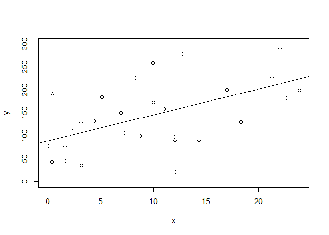
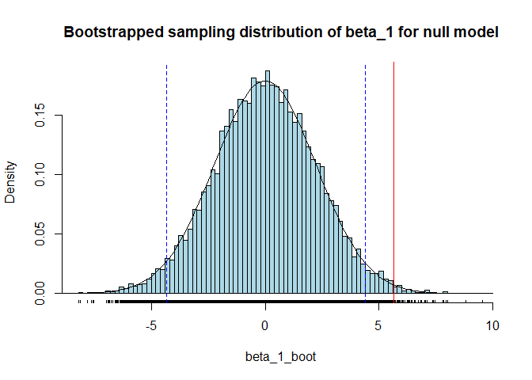

Solution to bootstrap *p*-value
================
Brett Melbourne
15 Sep 2021

The task is to bootstrap a *p*-value for the slope
.

Algorithm:

    fit null model (beta_0 only)
    record beta_0 and sigma_e
    fit full model (beta_0 and beta_1)
    record the estimated beta_1 (call this beta_1_obs)
    repeat very many times
        generate data from the null model
        fit the full model
        record the estimated beta_1 (call this beta_1_boot)
    calculate the frequency beta_1_boot is as large or larger than beta_1_obs

Generate some fake data to work with. Your algorithm will use your own
dataset. This example has a loose relationship with large
.

``` r
set.seed(11.5) #make example reproducible
n <- 30  #size of dataset
b0 <- 100 #true y intercept
b1 <- 7 #true slope
s <- 100  #true standard deviation of the errors
x <- runif(n,min=0,max=25) #nb while we have used runif, x is not a random variable
y <- b0 + b1 * x + rnorm(n,sd=s) #random sample of y from the population
```

Fit null model (intercept only) and record parameters

``` r
fit_m0 <- lm(y~1)
beta_0 <- coef(fit_m0)[1]
sigma_e <- sqrt(sum(fit_m0$residuals^2) / fit_m0$df.residual)
```

Fit full model (intercept and slope) and record slope

``` r
fit_m1 <- lm(y~x)
beta_1 <- coef(fit_m1)[2]
```

Visualize data with fitted full model

``` r
plot(x,y,ylim=c(0,300))
abline(fit_m1)
```

<!-- -->

Bootstrap algorithm

``` r
reps <- 10000
beta_1_boot <- rep(NA,reps)
for ( i in 1:reps ) {
    y_boot <- beta_0 + rnorm(n,sd=sigma_e)
    fit_m1_boot <- lm(y_boot~x)
    beta_1_boot[i] <- coef(fit_m1_boot)[2]
    if ( i %% 1000 == 0 ) print(paste(100*i/reps,"%",sep="")) #monitoring
}
```

Calculate two-tailed *p*-value, which is the notion that the magnitude
of the observed

is at issue and not its specific sign, so we need to consider magnitudes
of

of either sign in the sampling distribution.

``` r
sum( beta_1_boot >= beta_1 | beta_1_boot <= -beta_1 ) / reps
```

    ## [1] 0.0117

``` r
#sum(abs(beta_1_boot) >= abs(beta_1)) / reps #equivalent
```

Compare the bootstrap *p*-value to the classical *p*-value. It’s very
similar in this case. The appropriate *p*-value is on line `x`.

``` r
summary(fit_m1)
```

    ## 
    ## Call:
    ## lm(formula = y ~ x)
    ## 
    ## Residuals:
    ##      Min       1Q   Median       3Q      Max 
    ## -141.772  -51.602   -2.406   25.209  177.552 
    ## 
    ## Coefficients:
    ##             Estimate Std. Error t value Pr(>|t|)    
    ## (Intercept)   89.391     23.333   3.831  0.00066 ***
    ## x              5.638      1.974   2.855  0.00801 ** 
    ## ---
    ## Signif. codes:  0 '***' 0.001 '**' 0.01 '*' 0.05 '.' 0.1 ' ' 1
    ## 
    ## Residual standard error: 75.82 on 28 degrees of freedom
    ## Multiple R-squared:  0.2255, Adjusted R-squared:  0.1979 
    ## F-statistic: 8.153 on 1 and 28 DF,  p-value: 0.008006

Visualize the bootstrap distribution.

``` r
hist(beta_1_boot,freq=FALSE,breaks=100,col="lightblue",main=
         "Bootstrapped sampling distribution of beta_1 for null model")
rug(beta_1_boot,ticksize=0.01)
abline(v=beta_1,col="red")
abline(v=quantile(beta_1_boot,p=c(0.025,0.975)),col="blue",lty=2)
lines(seq(-10,10,0.1),dnorm(seq(-10,10,0.1),mean=0,sd=sd(beta_1_boot)))
```

<!-- -->

As usual, the histogram show us the result of the bootstrap. I have
added a rug plot, which puts a tickmark for each bootstrap replicate. I
have also added a red line to show the observed (fitted) value for

and two vertical dashed lines that show the 2.5% and 97.5% quantiles of
the bootstrap distribution. I have also overlaid a Normal distribution
on the histogram. We see that the bootstrap distribution tends Normal,
as expected from theory based on the assumptions of the null model.

We can explore other options for the statistic and for the estimate of
.
If we take

from the full model, the *p*-value seems over-optimistic in this case.
If we use the *t* statistic and take

from the full model, we find that the *p*-value is almost identical to
the classical result, which matches the setup of the classical test.
Also, with the *t* statistic it makes little difference whether

is from the null or the full model because the *t* statistic
standardizes

by its standard error, which in turn is a function of
.
