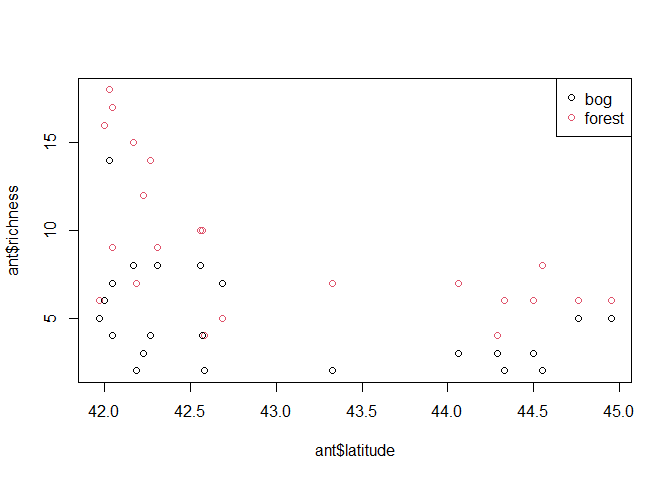
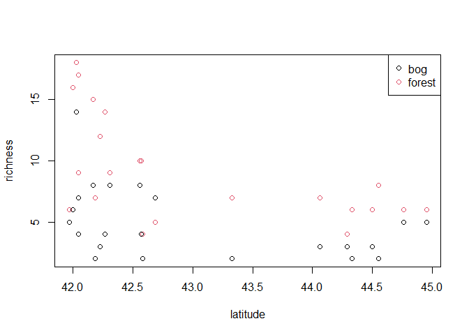
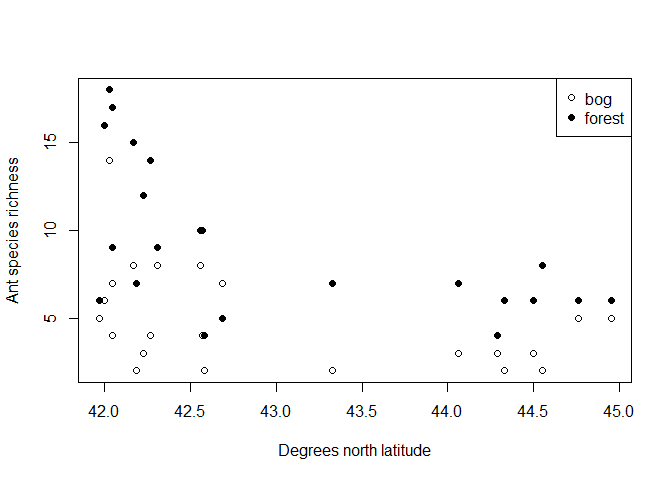
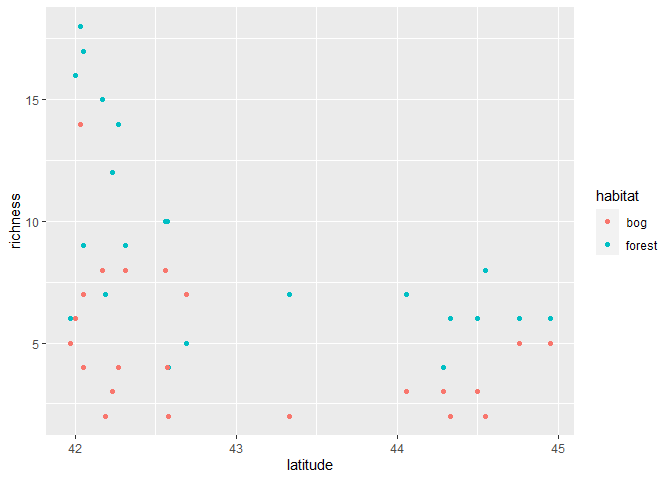
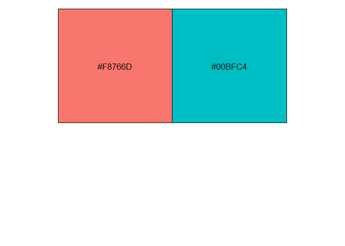
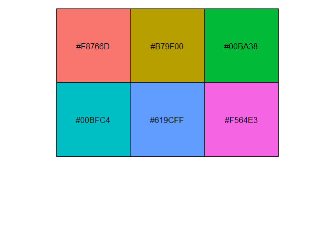
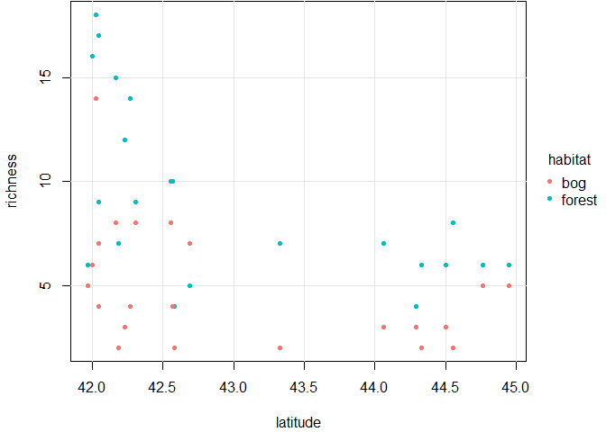
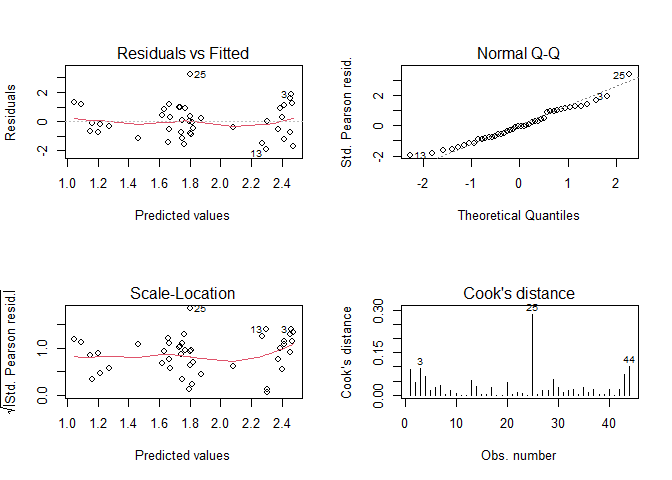
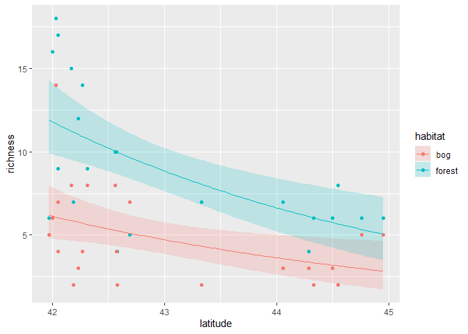
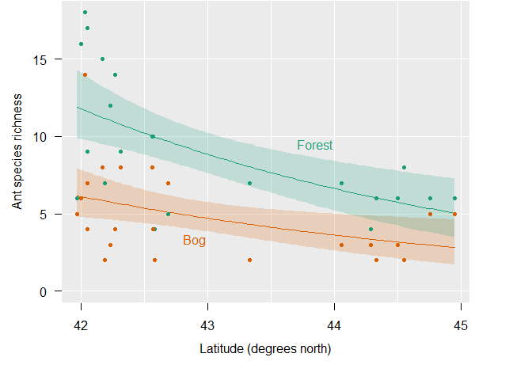

Ant data Generalized Linear Model - Frequentist
================
Brett Melbourne
11 Oct 2018 (updated 21 Oct 2021)

This is the first in a series of scripts to analyze the ant data
described in Ellison (2004). This script includes plotting variations
(ggplot & base) and frequentist inference from the GLM. Future scripts
will consider a Bayesian approach to the ant analysis, as well as
multilevel models to fully account for the design structure and data
variance.

This script can be rendered to a reproducible report.  
`rmarkdown::render("09_5_ants_frequentist.Rmd")`, or *Ctrl+Shift+K* in
RStudio.

``` r
library(ggplot2)
library(scales) #for ggplot color palette in function hue_pal
```

## EDA

Read in the ants data:

``` r
ant <- read.csv("data/ants.csv")
head(ant)
```

    ##   site habitat latitude elevation richness
    ## 1  TPB  forest    41.97       389        6
    ## 2  HBC  forest    42.00         8       16
    ## 3  CKB  forest    42.03       152       18
    ## 4  SKP  forest    42.05         1       17
    ## 5   CB  forest    42.05       210        9
    ## 6   RP  forest    42.17        78       15

For now we will focus on the relationship of species richness with
latitude and habitat. Later we will consider the other variables.

Convert habitat to a factor

``` r
ant$habitat <- factor(ant$habitat)
```

I will illustrate various approaches to plotting the data in both base
graphics and ggplot. First, a basic plot, in the plot.default style of
base plot. There are several things to note. 1) We need to extract the
columns from the data frame using the `$` operator. 2) We use the
graphical parameter `col` to map habitat type to point color. 3) We can
make the legend automatically plot the correct colors for each level of
habitat by using the functions `levels` and `nlevels`.

``` r
?plot.default #more information here
```

``` r
plot(ant$latitude, ant$richness, col=ant$habitat)
legend("topright", levels(ant$habitat), col=1:nlevels(ant$habitat), pch=1)
```

<!-- -->

The base plot defaults are open circles as points, which is good for
visualizing over-plotting, and black and red for the first two colors,
which provides reasonable contrast.

We can make a similar plot in the plot.formula style. The two things
that change: 1) We use a formula to specify the y and x variables, using
standard model formulae notation (`?formula`). 2) The data frame is
given in a separate argument. The code for the `plot()` function is now
cleaner because we don’t need to repeatedly specify the data frame (but
the `legend()` function is unchanged).

``` r
?plot.formula #more information here
```

``` r
plot(richness ~ latitude, col=habitat, data=ant)
legend("topright", levels(ant$habitat), col=1:nlevels(ant$habitat), pch=1)
```

<!-- -->

The resulting plot is the same as the previous one except with nicer
default axis labels.

Another approach is to use the `with()` function to specify the data
frame, which has the benefit of working equally with the `legend()`
function. This will produce an identical plot to the previous code.

``` r
with(ant, plot(latitude, richness, col=habitat))
with(ant, legend("topright", levels(habitat), col=1:nlevels(habitat), pch=1))
```

As a further exploration of some base plot options, we’ll reproduce the
original Figure 12a of Ellison, which was in black and white. I will
explicitly give all of the variable mappings to highlight a grammar of
graphics style. This time we map habitat to plotting character (symbol)
using the graphics option `pch` but effectively we are mapping habitat
to color (2 colors, black and white), an effective choice because it
provides a color scale with maximum contrast for the 2-level factor. To
control the plotting character we use the extract function `[]`, which
uses the numerical levels of the habitat factor (see `?"["`). We’ve
added nicer axis labels.

``` r
with(data=ant,
{
    plot(x=latitude, y=richness, pch=c(1,16)[habitat],
         ylab="Ant species richness", xlab="Degrees north latitude")
    legend("topright", levels(habitat), pch=c(1,16))
}
)
```

<!-- -->

Now, let’s take a look at `ggplot`. The most common, abbreviated, style
would be

``` r
ggplot(ant, aes(latitude, richness, col=habitat)) + 
    geom_point()
```

<!-- -->

Clearly this is an attractive and effective default plot. Some of the
choices compared to the base plot defaults are the use of a grid to aid
judging distance on a common scale, a color scale with good contrast
between categories, filled points and a grey background to help the
points pop, and an automatic legend placed outside of the plotting area.

Since we are focusing on the grammar of graphics logic and particularly
the mapping of variables to visual channels, from here we’ll use a
slightly more verbose style to emphasize our thoughtful choices. The
following code would produce a plot identical to the plot made by the
terser code above.

``` r
ggplot(data=ant, mapping=aes(x=latitude, y=richness, col=habitat)) + 
    geom_point()
```

A nice feature of `ggplot` is the use of themes. Here is the same plot
with the black and white theme.

``` r
ggplot(data=ant, mapping=aes(x=latitude, y=richness, col=habitat)) + 
    geom_point() +
    theme_bw()
```

<!-- -->

You can use a grammar of graphics workflow with base plot functions too.

One of the most recognizable features of ggplot is its default color
scale. Here’s how to use that color scale with base plot. The color
scale is derived from certain settings in the `hue_pal()` function in
the `scales` package. We’ll set up a new function called `ggc` (“ggplot
colors”) that, when called with `ggc(n)`, will return a color palette
with `n` colors.

``` r
ggc <- hue_pal(h = c(0, 360) + 15, c = 100, l = 65, h.start = 0, direction = 1)
```

Here’s what we get when we ask for a 2 color palette.

``` r
show_col(ggc(2))
```

<!-- -->

and here’s a 6 color palette.

``` r
show_col(ggc(6))
```

<!-- -->

Reproducing the previous plot now with base plot using a grammar of
graphics logic:

``` r
with(data=ant,
{
    # Set margins to achieve a similar aspect-ratio to ggplot
    par(mar=c(4, 4, 0, 4.5) + 0.1)
  
    # Set up coordinate system with default x and y scales and a grid
    plot(x=latitude, y=richness, type="n")
    grid(lty=1, lwd=0.5, col="gray90")
  
    # Add point layer with mappings to visual channels
    points(x=latitude, y=richness, col=ggc(2)[habitat], pch=20)
  
    # Add a legend to the outer margin (by first adding a blank panel)
    par(mar=c(4, 4, 0, 0) + 0.1, new=TRUE)
    plot(1, 1, type="n", axes=FALSE, ann=FALSE)
    legend("right", levels(habitat), col=ggc(2), pch=20, title="habitat", bty="n")
}
)
```

<!-- -->

This is essentially the same as the previous plot made by `ggplot`.
Clearly base plot is more work than `ggplot` but base plot is good, if
sometimes ad hoc, for those times that you need complete control of the
graphical elements.

## Training

Now, let’s move on to analysis. Fit the full model using `glm()`, which
uses a maximum likelihood algorithm:

``` r
fitHxL <- glm(richness ~ habitat + latitude + habitat:latitude, family=poisson, data=ant)
coef(fitHxL) #Maximum likelihood estimates of parameters
```

    ##            (Intercept)          habitatforest               latitude 
    ##            12.77869292             1.75682959            -0.26109963 
    ## habitatforest:latitude 
    ##            -0.02623362

Diagnostic plots

``` r
par(mfrow=c(2,2))
plot(fitHxL,1:4, ask=FALSE)
```

<!-- -->

Overall, the diagnostics seem not too bad. It is certainly an
improvement over the Normal linear model we tried before. There is
perhaps still a slight tendency for the standardized residuals to
increase with the mean (we’ll investigate that further later) and there
is an influential point (case 25). We should investigate the influential
point using our case deletion algorithm to examine parameter sensitivity
to this point. We’ll return to that later as we continue to improve the
model.

## Inference

Out of the box inferences about parameter uncertainty come from the
assumption of a Normal sampling distribution for the parameter z-values
(estimate divided by standard error), giving us a p-value for each
parameter.

``` r
summary(fitHxL)
```

    ## 
    ## Call:
    ## glm(formula = richness ~ habitat + latitude + habitat:latitude, 
    ##     family = poisson, data = ant)
    ## 
    ## Deviance Residuals: 
    ##     Min       1Q   Median       3Q      Max  
    ## -2.1562  -0.7929  -0.0332   0.8516   2.7420  
    ## 
    ## Coefficients:
    ##                        Estimate Std. Error z value Pr(>|z|)   
    ## (Intercept)            12.77869    4.40625   2.900  0.00373 **
    ## habitatforest           1.75683    5.47728   0.321  0.74840   
    ## latitude               -0.26110    0.10303  -2.534  0.01127 * 
    ## habitatforest:latitude -0.02623    0.12809  -0.205  0.83773   
    ## ---
    ## Signif. codes:  0 '***' 0.001 '**' 0.01 '*' 0.05 '.' 0.1 ' ' 1
    ## 
    ## (Dispersion parameter for poisson family taken to be 1)
    ## 
    ##     Null deviance: 102.763  on 43  degrees of freedom
    ## Residual deviance:  50.242  on 40  degrees of freedom
    ## AIC: 218.6
    ## 
    ## Number of Fisher Scoring iterations: 4

``` r
coef(summary(fitHxL))[,1:2]   #or use this for just the coefficients
```

However, most of the parameter hypotheses being considered here are not
meaningful, either because we don’t care about them biologically
(e.g. we don’t care about the `intercept` hypothesis that species
richness is different from zero at the equator), or because the
parameters are all interdependent (e.g. the fact that the
`habitatforest` parameter is not significantly different from zero means
nothing because it is balanced against the estimate for
`habitatforest:latitude`). The one slightly meaningful inference is for
the `habitatforest:latitude` parameter, which is telling us that there
is little evidence for an interaction on the scale of the linear
predictor. But even this doesn’t necessarily translate to the biological
hypothesis of no interaction between habitat and latitude since the
relationship with latitude is nonlinear, as we will see more clearly
when the fitted model is plotted below. Take away: most of the
hypothesis tests in these summary tables are usually irrelevant to
hypotheses that we are scientifically interested in, except in
infrequent special cases. As we’ll see later, if we want to test
specific scientific hypotheses, we’ll need to be deliberate about
expressing them as alternative models.

95% confidence intervals for parameters are obtained by profiling the
likelihood surface. This is just as we did earlier by varying one
parameter while optimizing over the others. Here, the intervals are
frequentist and are formed by assuming that the likelihood ratio has a

sampling distribution. Note this is not the same as the pure likelihood
intervals we constructed earlier since here the likelihood ratio is
merely a statistic and the inferential basis is the sampling
distribution of the statistic.

``` r
confint(fitHxL)
```

    ## Waiting for profiling to be done...

    ##                             2.5 %      97.5 %
    ## (Intercept)             4.4193660 21.75722597
    ## habitatforest          -9.1480324 12.38251387
    ## latitude               -0.4714597 -0.06606674
    ## habitatforest:latitude -0.2745658  0.22901128

The correlation matrix for the parameters shows how the `habitatforest`
and `habitatforest:latitude` parameters are highly interdependent.

``` r
cov2cor(vcov(fitHxL))
```

    ##                        (Intercept) habitatforest   latitude
    ## (Intercept)              1.0000000    -0.8044583 -0.9997593
    ## habitatforest           -0.8044583     1.0000000  0.8042646
    ## latitude                -0.9997593     0.8042646  1.0000000
    ## habitatforest:latitude   0.8041116    -0.9997617 -0.8043052
    ##                        habitatforest:latitude
    ## (Intercept)                         0.8041116
    ## habitatforest                      -0.9997617
    ## latitude                           -0.8043052
    ## habitatforest:latitude              1.0000000

Although meaningless for a single model, the log likelihood is useful
for comparison with alternative models. Here’s how we can extract the
log likelihood.

``` r
logLik(fitHxL)
```

    ## 'log Lik.' -105.2982 (df=4)

To construct regression intervals, we can use the `predict()` function.
For GLMs, there is no ’ interval = “confidence” ’ option, so we have to
construct intervals from the standard errors. This is approximate. More
accurate intervals are obtained by parametric bootstrap.

``` r
newd <- data.frame(latitude = rep(seq(min(ant$latitude), max(ant$latitude), length.out=100),2),
                   habitat = factor(rep(c("bog","forest"),each=100)))
preds <- predict(fitHxL,newdata=newd,se.fit=TRUE)
mnlp <- preds$fit        #mean of the linear predictor
selp <- preds$se.fit     #se of the linear predictor
cillp <- mnlp - 2 * selp #lower of 95% CI for linear predictor
ciulp <- mnlp + 2 * selp #upper
cil <- exp(cillp)        #lower of 95% CI for response scale
ciu <- exp(ciulp)        #upper
mn <- exp(mnlp)          #mean of response scale
preds <- cbind(newd,preds,cil,ciu,mn)
```

In `ggplot` we can plot this in three layers:

-   a ribbon geom (a type of polygon) for intervals, using the `alpha`
    setting to obtain a nice see-through effect
-   a line geom for estimated means
-   a point geom for the data

We have two dataframes, one with the data and the other with the
predictions, so we need to specify the dataframe for each layer. By
giving the point layer second in the sequence, the y-axis label is
“richness” (if we put the line layer second, the label is “mn”) .

``` r
ggplot() +
    geom_ribbon(data=preds, mapping=aes(x=latitude, ymin=cil, ymax=ciu, fill=habitat), alpha=0.2) +
    geom_point(data=ant, mapping=aes(x=latitude, y=richness, col=habitat)) +
    geom_line(data=preds, mapping=aes(x=latitude, y=mn, col=habitat))
```

<!-- -->

Finally, here is an illustration of how we can use base plot with
similar styling to the `ggplot` defaults. We’ll add three variations to
improve visual perception:

-   colors with semantic meaning (green for forest, orange/brown for
    bog) that are also colorblind friendly
-   labels added directly to the plot to reduce translational effort
-   y-axis also includes zero

``` r
# Bog & Forest colors
bfc <- c("#d95f02", "#1b9e77")

# Coordinate system with scales (ticks and lines), and grey background
par(mar=c(5, 4, 0, 4) + 0.1)
with(ant, plot(x=latitude, y=richness, ylim=c(0,18), type="n", axes=FALSE, ann=FALSE))
u <- par("usr") #The coordinates of the plot area
rect(u[1], u[3], u[2], u[4], col="grey92", border=NA) #grey background
axis(1, at=42:45, col=NA, col.ticks="black")
axis(2, col=NA, col.ticks="black", las=2)
abline(v=axTicks(1), col="white", lty=1)
abline(h=axTicks(2), col="white", lty=1)

# A polygon layer for intervals
h <- c("bog","forest")
for ( i in 1:2 ) {
    subd <- subset(preds, habitat==h[i])
    x <- subd$latitude
    ymin <- subd$cil
    ymax <- subd$ciu
    polygon(x=c(x, rev(x)), y=c(ymin, rev(ymax)),
            col=adjustcolor(bfc[i], alpha.f=0.2),
            border=NA)
}

# A line layer for means
for ( i in 1:2 ) {
    subd <- subset(preds, habitat==h[i])
    with(subd, lines(x=latitude, y=mn, col=bfc[i], lty=1))
}

# A points layer for the data
with(ant, points(x=latitude, y=richness, col=bfc[habitat], pch=20))

# Annotations
mtext("Latitude (degrees north)", 1, line=2.5)
mtext("Ant species richness", 2, line=2.5)
text(42.9,3.3, "Bog", col=bfc[1])
text(43.85,9.5, "Forest", col=bfc[2])
```

<!-- -->

Compared to `ggplot`, it is clear that we have to do extra subsetting
and styling work to achieve the same result but base plot is very
flexible if somewhat hacky and ad hoc. Since no packages were used, this
plot will be highly reproducible over time.
