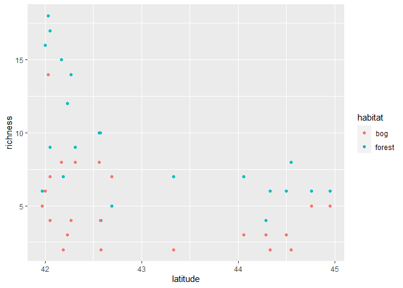

Ant data Generalized Linear Model - Bayesian
================
Brett Melbourne
16 Oct 2018 (updated 22 Oct 2021)

Second in a series of scripts to analyze the ant data described in
Ellison (2004). This script includes Bayesian inference from the GLM.
Future scripts will consider multilevel models to fully account for the
design structure.

This script can be rendered to a reproducible report.  
`rmarkdown::render("09_8_ants_bayesian_GLM.Rmd")`, or *Ctrl+Shift+K* in
RStudio.

Set up for Bayesian analysis (order is important):

``` r
library(ggplot2)
library(dplyr)
library(tidyr)
library(rstan) #to extract() samples (nb conflict with tidyr)
library(rstanarm) #nb function se over-rides rethinking version
options(mc.cores=parallel::detectCores())
rstan_options(auto_write=TRUE)
theme_set(theme_grey()) #rstanarm overrides default ggplot theme: set it back
source("source/hpdi.R") #For calculating credible intervals
```

Read in the data

``` r
ant <- read.csv("data/ants.csv")
ant$habitat <- factor(ant$habitat)
```

Plot

``` r
ggplot(data=ant, mapping=aes(x=latitude, y=richness, col=habitat)) +
    geom_point()
```

<!-- -->

## Training

Bayesian fit with `rstanarm`

``` r
bysfitHxL <- stan_glm(richness ~ habitat + latitude + habitat:latitude, 
                      family=poisson, data=ant)
summary(bysfitHxL, digits=4)
```

    ## 
    ## Model Info:
    ##  function:     stan_glm
    ##  family:       poisson [log]
    ##  formula:      richness ~ habitat + latitude + habitat:latitude
    ##  algorithm:    sampling
    ##  sample:       4000 (posterior sample size)
    ##  priors:       see help('prior_summary')
    ##  observations: 44
    ##  predictors:   4
    ## 
    ## Estimates:
    ##                          mean    sd      10%     50%     90%  
    ## (Intercept)            13.4734  3.2000  9.4453 13.4284 17.6571
    ## habitatforest           0.8740  2.9744 -2.8818  0.8480  4.6911
    ## latitude               -0.2775  0.0748 -0.3759 -0.2769 -0.1834
    ## habitatforest:latitude -0.0056  0.0696 -0.0952 -0.0050  0.0819
    ## 
    ## Fit Diagnostics:
    ##            mean   sd     10%    50%    90% 
    ## mean_PPD 7.0131 0.5699 6.2955 7.0000 7.7273
    ## 
    ## The mean_ppd is the sample average posterior predictive distribution of the outcome variable (for details see help('summary.stanreg')).
    ## 
    ## MCMC diagnostics
    ##                        mcse   Rhat   n_eff
    ## (Intercept)            0.0853 1.0035 1406 
    ## habitatforest          0.0884 1.0026 1132 
    ## latitude               0.0020 1.0035 1404 
    ## habitatforest:latitude 0.0021 1.0026 1133 
    ## mean_PPD               0.0101 1.0007 3169 
    ## log-posterior          0.0367 0.9995 1459 
    ## 
    ## For each parameter, mcse is Monte Carlo standard error, n_eff is a crude measure of effective sample size, and Rhat is the potential scale reduction factor on split chains (at convergence Rhat=1).

``` r
vcov(bysfitHxL, correlation=TRUE) #Correlation matrix
```

    ##                        (Intercept) habitatforest   latitude
    ## (Intercept)              1.0000000    -0.5991090 -0.9995241
    ## habitatforest           -0.5991090     1.0000000  0.5985856
    ## latitude                -0.9995241     0.5985856  1.0000000
    ## habitatforest:latitude   0.5986358    -0.9991331 -0.5991623
    ##                        habitatforest:latitude
    ## (Intercept)                         0.5986358
    ## habitatforest                      -0.9991331
    ## latitude                           -0.5991623
    ## habitatforest:latitude              1.0000000

We see especially that the Rhat values are all 1, indicating
convergence, and n\_eff is quite good (1000+) for all parameters.

### Working with posterior samples

We’ll first work with the samples directly (as we did in McElreath Ch
4). There are also convenience functions to do many standard things but
we will often want to calculate new quantities from the samples directly
to answer science questions that aren’t addressed by the standard
output, so this is important to know.

``` r
samples <- extract(bysfitHxL$stanfit)
class(samples)
```

    ## [1] "list"

``` r
str(samples)
```

    ## List of 4
    ##  $ alpha   : num [1:4000, 1] 8.03 10.04 18.25 14.04 14.09 ...
    ##   ..- attr(*, "dimnames")=List of 2
    ##   .. ..$ iterations: NULL
    ##   .. ..$           : NULL
    ##  $ beta    : num [1:4000, 1:3] 6.212 3.185 -0.686 1.542 1.469 ...
    ##   ..- attr(*, "dimnames")=List of 2
    ##   .. ..$ iterations: NULL
    ##   .. ..$           : NULL
    ##  $ mean_PPD: num [1:4000(1d)] 6.18 6.91 7.07 6.91 7.23 ...
    ##   ..- attr(*, "dimnames")=List of 1
    ##   .. ..$ iterations: NULL
    ##  $ lp__    : num [1:4000(1d)] -114 -111 -111 -110 -113 ...
    ##   ..- attr(*, "dimnames")=List of 1
    ##   .. ..$ iterations: NULL

``` r
names(samples)
```

    ## [1] "alpha"    "beta"     "mean_PPD" "lp__"

### Diagnostics

Histograms directly from the samples. This of course is not merely
diagnostic if we consider the posterior distribution to be the full
inference for a parameter. Diagnostically, we want to ask if the samples
are giving us a good picture of the posterior distribution. We see that
the distributions of the posterior samples are roughly symmetric as
expected and not terribly noisy.

``` r
hist(samples$alpha[,1], breaks=75, col="lightblue") #beta_0 = intercept = alpha 
```

<!-- -->

``` r
hist(samples$beta[,1], breaks=75, col="lightblue") #beta_1
```

<!-- -->

``` r
hist(samples$beta[,2], breaks=75, col="lightblue") #beta_2
```

<!-- -->

``` r
hist(samples$beta[,3], breaks=75, col="lightblue") #beta_3
```

<!-- -->

To do the same with `ggplot`, we first need the samples in a dataframe
and then in tidy format (using `gather`). One could make a function for
this that works generically on extracted samples. No doubt, there is a
package that does this.

``` r
samplesdf <- data.frame(samples$alpha, samples$beta)
names(samplesdf) <- c("alpha", paste(names(samples[2]), 1:3, sep="_"))
samplesdf %>% 
    gather(key="parameter", value="sample") %>%
    ggplot() +
    geom_histogram(mapping=aes(x=sample, y=stat(density)), bins=75) +
    facet_wrap(facets= ~ parameter, scales="free")
```

<!-- -->

Manual trace plot from the samples. This example is for alpha (aka
beta\_0)

``` r
intercept_trace <- extract(bysfitHxL$stanfit, pars="alpha", permuted=FALSE, inc_warmup=TRUE)
plot(NA, NA, type="n", ylim=range(intercept_trace), xlim=c(0,length(intercept_trace[,1,1])))
for ( i in 1:4 ) {
    lines(intercept_trace[,i,1], col=i)  
}
```

<!-- -->

We see that the chains have converged.

## Inference

95% credible intervals (HPDI), directly from the samples

``` r
hpdi(samples$alpha[,1], prob=0.95)
```

    ##         lower    upper
    ## [1,] 7.502561 19.80513

``` r
hpdi(samples$beta[,1], prob=0.95)
```

    ##          lower    upper
    ## [1,] -4.893369 6.646087

``` r
hpdi(samples$beta[,2], prob=0.95)
```

    ##           lower     upper
    ## [1,] -0.4252479 -0.138108

``` r
hpdi(samples$beta[,3], prob=0.95)
```

    ##           lower     upper
    ## [1,] -0.1432306 0.1269792

These are almost the same as the CPIs due to the symmetric posteriors.
Here is the convenience function for the parameter CPIs:

``` r
posterior_interval(bysfitHxL, prob=0.95)
```

    ##                              2.5%      97.5%
    ## (Intercept)             7.2755551 19.5854775
    ## habitatforest          -4.8752415  6.6711443
    ## latitude               -0.4207775 -0.1319685
    ## habitatforest:latitude -0.1420467  0.1294288

There is a good argument for using the CPI here in lieu of the HPDI. We
saw from the histograms that the posteriors are quite symmetric but also
that there was still some noise in the tails of the samples. Thus, the
CPI is probably a more numerically stable estimate of the credible
interval, even though the CPI is not a credible interval itself.

Mean curves, regression intervals (HPDI), posterior predictive
distribution, directly from the samples. The following is quite literal.
We could make this more elegant but the steps needed are clear this way.

``` r
# Initialize variables and storage 
latitude <- seq(from=41.92, to=45, length.out=50) #range for latitude
n <- length(latitude)
hpdi_bog <- matrix(NA, nrow=n, ncol=5) #to store hpdi values and mean
colnames(hpdi_bog) <- c("mnmu","mulo95","muhi95","ppdlo95","ppdhi95")
hpdi_forest <- matrix(NA, nrow=n, ncol=5)
colnames(hpdi_forest) <- c("mnmu","mulo95","muhi95","ppdlo95","ppdhi95")

# For each latitude, form the posterior
for ( i in 1:n ) {
    
    # First form samples for the linear predictor \eta
    eta_bog <- samples$alpha[,1] + 
               samples$beta[,2] * latitude[i]
    eta_forest <- samples$alpha[,1] + 
                  samples$beta[,1] + 
                  samples$beta[,2] * latitude[i] + 
                  samples$beta[,3] * latitude[i]
    
    # Then use inverse link for samples of the posterior \mu
    mu_bog <- exp(eta_bog)
    mu_forest <- exp(eta_forest)
    
    # Sample from Poisson to get the posterior predictive distribution
    ppd_bog <- rpois(n=length(mu_bog), lambda=mu_bog)
    ppd_forest <- rpois(n=length(mu_forest), lambda=mu_forest)
    
    # Mean and intervals of these samples
    hpdi_bog[i,1] <- mean(mu_bog)
    hpdi_bog[i,2:3] <- hpdi(mu_bog, prob=0.95)
    #hpdi_bog[i,4:5] <- hpdi(ppd_bog, prob=0.95)
    hpdi_bog[i,4:5] <- quantile(ppd_bog, prob=c(0.025,0.975)) #CPI
    hpdi_forest[i,1] <- mean(mu_forest)
    hpdi_forest[i,2:3] <- hpdi(mu_forest, prob=0.95)
    #hpdi_forest[i,4:5] <- hpdi(ppd_forest, prob=0.95)
    hpdi_forest[i,4:5] <- quantile(ppd_forest, prob=c(0.025,0.975)) #CPI
    
}
```

Notice that we calculated expectations (means) and intervals directly on
the scale of the data (the “response” scale), not on the linear
predictor scale. If we calculated first on the linear predictor scale
and then backtransformed the intervals to the response scale they would
be biased due to nonlinear averaging. Also, the posterior predictive
distribution (PPD) can, of course, only be on the response scale. I used
the CPI (`quantile()`) for the posterior predictive distribution because
plots of the HPDI and CPI were substantially similar but the CPI was
more numerically stable.

Package in tidy format for plotting

``` r
mcpreds_df <- data.frame(habitat=rep("bog",n), latitude, hpdi_bog)
mcpreds_df <- rbind(mcpreds_df, data.frame(habitat=rep("forest",n), latitude, hpdi_forest))
rm(latitude,n,hpdi_bog,hpdi_forest,eta_bog,eta_forest,mu_bog,mu_forest) #clean up
```

Plot the inference  
I have done a bit of customization for colors and labels. The credible
intervals for the means are the shaded regions while the dashed lines
show the posterior predictive interval.

``` r
ggplot() +
    geom_ribbon(data=mcpreds_df, 
        mapping=aes(x=latitude, ymin=mulo95, ymax=muhi95, fill=habitat),
        alpha=0.2, show.legend=FALSE) +
    geom_point(data=ant, 
        mapping=aes(x=latitude, y=richness, col=habitat),
        show.legend=FALSE) +
    geom_line(data=mcpreds_df,
        mapping=aes(x=latitude, y=mnmu, col=habitat),
        show.legend=FALSE) +
    geom_line(data=mcpreds_df,
        mapping=aes(x=latitude, y=ppdlo95, col=habitat),
        lty=2, show.legend=FALSE) +
    geom_line(data=mcpreds_df,
        mapping=aes(x=latitude, y=ppdhi95, col=habitat),
        lty=2, show.legend=FALSE) +
    geom_text(mapping=aes(x=42.9, y=3.3, label="Bog"), col="#d95f02") +
    geom_text(mapping=aes(x=43.85, y=9.5, label="Forest"), col="#1b9e77") +
    scale_fill_manual(values=c("#d95f02","#1b9e77")) +
    scale_color_manual(values=c("#d95f02","#1b9e77")) +
    ylim(0,20) +
    xlab("Latitude (degrees north)") +
    ylab("Ant species richness") 
```

<!-- -->

Notice that the intervals for forest are wider than for bog. This is
because the uncertainty scales with the mean of the response. Also
notice that the intervals for the posterior predictive distribution have
discrete steps. This is because the data generating process is discrete
(e.g. we cannot have 1.3 species). Also, there are a few blips in the
intervals for the predictive distribution and some wiggles in the mean
intervals. This is due to Monte Carlo error. Increase the number of
iterations when training the model (e.g. iter=10000) and these will
largely go away.

Let’s consider now our original three scientific questions. We can
answer question 2: How does species richness vary with latitude? The
above plot shows this. Species richness declines with latitude and
appears to be well described by a gentle exponential decline over the
range of the data (because the inverse link function is exponential).
The uncertainty in this relationship for both habitats is shown by the
credible intervals for the mean. We can also answer question 3: Is this
relationship different between habitats? There are two answers,
depending on our view. On the one hand, we could conclude from the plot
that species richness starts higher and declines faster with latitude in
forest than in bog habitat. On the other hand, the exponential decline
is about the same and there is little evidence for a difference in the
exponent. Apart from starting higher, the nonlinear equation for the
exponential decline is about the same. That is, there is little evidence
for a difference in the exponent as judged by the uncertainty in beta\_3
(the difference in the exponent between habitats).

We can’t properly answer question 1: How different is species richness
between habitats? We can see from the plot above that mean species
richness is mostly higher in forest than bog, judging by the non-overlap
of the credible intervals for the mean. We can also roughly read off the
difference (about 5.5 at latitude 42, or 2.5 at latitude 45). But we
haven’t yet precisely quantified this difference or its uncertainty. The
differences between habitats at different latitudes are derived
quantities. That is, the difference is a function of the parameters.
Thus, it is straightforward to form a posterior distribution for the
difference at each latitude from the posterior samples of the
parameters. I found the CPI to be a good and stable estimate of the
credible interval.

``` r
# Initialize variables and storage 
latitude <- seq(from=41.92, to=45, length.out=50) #range for latitude
n <- length(latitude)
forest_bog_diff <- matrix(NA, nrow=n, ncol=3) #to store mean and hpdi values
colnames(forest_bog_diff) <- c("mndiff","difflo95","diffhi95")

# For each latitude, form the posterior
for ( i in 1:n ) {
    
    # First form samples for the linear predictor \eta
    eta_bog <- samples$alpha[,1] + 
               samples$beta[,2] * latitude[i]
    eta_forest <- samples$alpha[,1] + 
                  samples$beta[,1] + 
                  samples$beta[,2] * latitude[i] + 
                  samples$beta[,3] * latitude[i]
    
    # Then use inverse link for samples of the posterior \mu
    mu_bog <- exp(eta_bog)
    mu_forest <- exp(eta_forest)
    
    # Now calculate the habitat difference (derived quantity)
    diff <- mu_forest - mu_bog
    
    # Mean and intervals of these samples
    forest_bog_diff[i,1] <- mean(diff)
    #forest_bog_diff[i,2:3] <- hpdi(diff, prob=0.95)
    forest_bog_diff[i,2:3] <- quantile(diff, prob=c(0.025,0.975)) #CPI

}

# Package in a dataframe
diff_df <- data.frame(cbind(forest_bog_diff, latitude))
rm(latitude,n,forest_bog_diff,eta_bog,eta_forest,mu_bog,mu_forest,diff) #clean up
```

Plot the difference with its uncertainty

``` r
ggplot(data=diff_df) +
    geom_ribbon(mapping=aes(x=latitude, ymin=difflo95, ymax=diffhi95),
        alpha=0.2) +
    geom_line(mapping=aes(x=latitude, y=mndiff)) +
    ylim(0,8) +
    xlab("Latitude (degrees north)") +
    ylab("Difference in species richness (forest - bog)") +
    theme_bw()
```

<!-- -->

Now we have quantitatively answered question 1: How different is species
richness between habitats? We can see how the difference declines with
latitude, and we can see how the uncertainty changes with latitude
showing that mean ant richness in forest is clearly higher than in bog
across the entire range of latitudes.

### Using convenience functions

Extracting everything manually from the samples is a fair bit of coding
work. The convenience functions in `rstanarm` make this easier for
common tasks. As in `glm()`, these functions take a `newdat` argument
that simplifies coding. To do what we just did manually above (except
for the analysis of the habitat differences), first make a dataframe
with the desired values of the explanatory variables.

``` r
newd <- data.frame(latitude=rep(seq(from=41.92, to=45, length.out=50), 2),
                   habitat=factor(rep(c("bog","forest"), each=50)))
```

Then derive samples for the posterior distribution of the inverse link
function, i.e. Dist(*μ*), which we’ll call `pmu`.

``` r
pmu <- posterior_linpred(bysfitHxL, transform=TRUE, newdata=newd)
```

This is a matrix with samples in rows and the variable combinations in
columns. The estimated means are then

``` r
mnmu <- colMeans(pmu)
```

and the credible intervals for the mean are

``` r
regression_intervals <- t(apply(pmu, 2, hpdi))
colnames(regression_intervals) <- c("mulo95","muhi95")
```

For predictions, first derive samples for the posterior predictive
distribution, which we’ll call ppd

``` r
ppd <- posterior_predict(bysfitHxL, newdata=newd)
```

and the prediction intervals (here CPI for stability) are then

``` r
prediction_intervals <- t(apply(ppd, 2, quantile, prob=c(0.025,0.975)))
colnames(prediction_intervals) <- c("ppdlo95","ppdhi95")
```

Plot (code is the same as the previous plot of the regression means)

``` r
mcpreds_df <- cbind(newd,mnmu,regression_intervals,prediction_intervals)

ggplot() +
    geom_ribbon(data=mcpreds_df, 
        mapping=aes(x=latitude, ymin=mulo95, ymax=muhi95, fill=habitat),
        alpha=0.2, show.legend=FALSE) +
    geom_point(data=ant, 
        mapping=aes(x=latitude, y=richness, col=habitat),
        show.legend=FALSE) +
    geom_line(data=mcpreds_df,
        mapping=aes(x=latitude, y=mnmu, col=habitat),
        show.legend=FALSE) +
    geom_line(data=mcpreds_df,
        mapping=aes(x=latitude, y=ppdlo95, col=habitat),
        lty=2, show.legend=FALSE) +
    geom_line(data=mcpreds_df,
        mapping=aes(x=latitude, y=ppdhi95, col=habitat),
        lty=2, show.legend=FALSE) +
    geom_text(mapping=aes(x=42.9, y=3.3, label="Bog"), col="#d95f02") +
    geom_text(mapping=aes(x=43.85, y=9.5, label="Forest"), col="#1b9e77") +
    scale_fill_manual(values=c("#d95f02","#1b9e77")) +
    scale_color_manual(values=c("#d95f02","#1b9e77")) +
    ylim(0,20) +
    xlab("Latitude (degrees north)") +
    ylab("Ant species richness") 
```

<!-- -->

## Summary

Comparing inference algorithms for frequentist and Bayesian approaches
to model means and predictions so far:

| Tool      | Mean                      | Uncertainty of mean       | Uncertainty of prediction |
|:----------|:--------------------------|:--------------------------|:--------------------------|
| lm        | predict()                 | predict(int=“confidence”) | predict(int=“prediction”) |
| glm       | predict(type= “response”) | predict(se.fit=TRUE)      | via bootstrap             |
|           |                           | or via bootstrap          |                           |
| stan\_glm | mean(pmu)                 | hpdi(pmu)                 | hpdi(ppd)                 |

where:

-   `pmu <- posterior_linpred(transform = TRUE)`
-   `ppd <- posterior_predict()`
