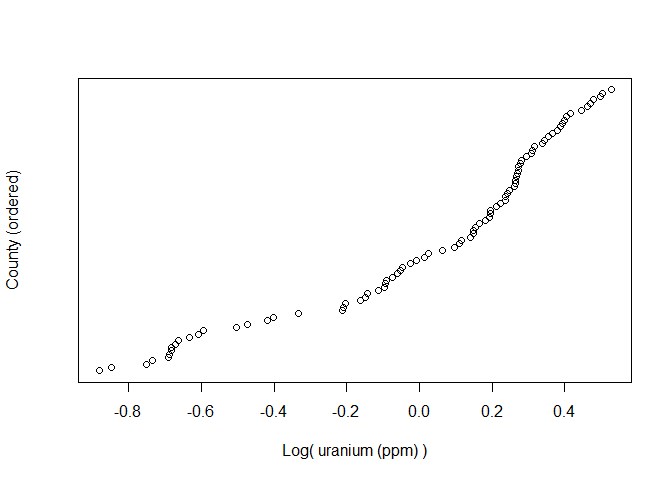
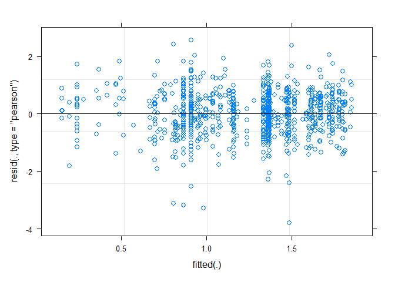
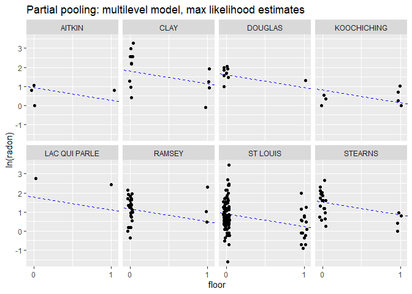
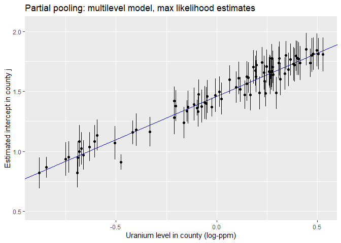
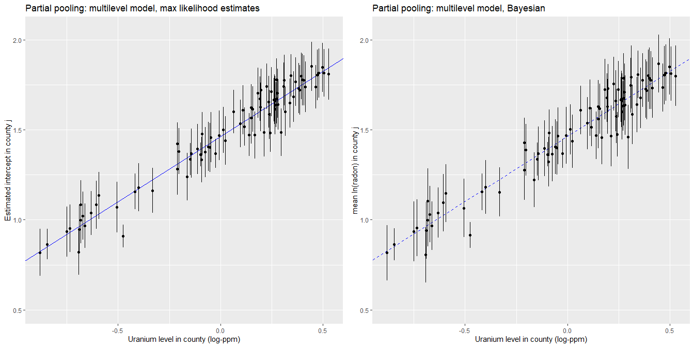

Multilevel model of radon levels III
================
Brett Melbourne
1 Nov 2018 (updated 28 Oct 2021)

Chapter 12 of Gelman & Hill  
See `data/radon_MN_about.txt` and  
`data/radon_MN_U_about.txt` for data source  

This is part III. Part I was EDA and introduction to partial pooling and
shrinkage (G&H 12.2). Part II considered a house-level predictor (G&H
12.3-4). Here, we add a county-level predictor (G&H 12.6).

``` r
library(lme4)      #max lik multilevel: lmer(), glmer() etc
library(arm)       #for se.ranef()
library(ggplot2)
library(gridExtra) #arranging multiple plots
library(dplyr)
library(rstan)     #for extract()
library(rstanarm)  #Bayesian multilevel: stan_lmer(), stan_glmer() etc
options(mc.cores=parallel::detectCores())
theme_set(theme_grey()) #rstanarm overrides default ggplot theme: set it back
```

Read in data and manipulate as required for analysis (see Parts I & II)

``` r
radon_dat <- read.csv("data/radon_MN.csv")
radon_dat$log_radon <- log(ifelse(radon_dat$radon==0, 0.1, radon_dat$radon))
radon_dat$county <- factor(radon_dat$county)
radon_dat$floor_x <- ifelse(radon_dat$floor=="basement", 0, 1)
head(radon_dat)
```

    ##      floor radon county log_radon floor_x
    ## 1    first   2.2 AITKIN 0.7884574       1
    ## 2 basement   2.2 AITKIN 0.7884574       0
    ## 3 basement   2.9 AITKIN 1.0647107       0
    ## 4 basement   1.0 AITKIN 0.0000000       0
    ## 5 basement   3.1  ANOKA 1.1314021       0
    ## 6 basement   2.5  ANOKA 0.9162907       0

### G&H 12.6. Analysis with a county level predictor (uranium)

The predictor at the county level is uranium. That is, measurement of
uranium was not done house by house. The dataset has just one value for
uranium per county.

``` r
uranium_dat <- read.csv("data/radon_MN_U.csv")
head(uranium_dat)
```

    ##      county     uppm
    ## 1    AITKIN 0.502054
    ## 2     ANOKA 0.428565
    ## 3    BECKER 0.892741
    ## 4  BELTRAMI 0.552472
    ## 5    BENTON 0.866849
    ## 6 BIG STONE 1.472640

Log uranium

``` r
uranium_dat$logu <- log(uranium_dat$uppm)
```

Plot of the uranium data  
This is a predictor variable, so we are not necessarily interested in
its distribution (thus, I do not choose a histogram here).

``` r
plot(x=sort(uranium_dat$logu),
     y=1:85,
     yaxt="n",
     ylab="County (ordered)",
     xlab="Log( uranium (ppm) )")
```

<!-- -->

I don’t see anything untoward in this plot.

Perhaps counterintuitively, we now add these county-scale uranium data
to the dataframe that contains all our other data. The data will then be
in a tidy data format. Each row contains an observation for the level of
radon in a house but we add a column for the county-scale uranium
associated with each house. This means that the county-scale uranium
values are repeated multiple times in the dataset. This might feel like
cheating: aren’t we pretending there are more uranium data than we
actually have? No, we are not. There is no problem here because uranium
will be a predictor variable. Furthermore, in the multilevel model, we
will be estimating the effect of uranium (*logu*) at the appropriate
scale by including *county* as a grouping variable.

``` r
radon_dat <- merge(radon_dat, uranium_dat, by="county", all.x=TRUE)
radon_dat[sample(1:nrow(radon_dat),50),] #print a sample of 50 rows to check
```

    ##         county    floor radon  log_radon floor_x     uppm        logu
    ## 146 COTTONWOOD    first   2.5  0.9162907       1 1.404330  0.33956032
    ## 765   ST LOUIS basement   4.6  1.5260563       0 0.622088 -0.47467372
    ## 81  BLUE EARTH basement   6.0  1.7917595       0 1.312080  0.27161366
    ## 583     RAMSEY basement   6.2  1.8245493       0 0.658327 -0.41805351
    ## 721   ST LOUIS basement   5.0  1.6094379       0 0.622088 -0.47467372
    ## 450   MAHNOMEN basement   3.9  1.3609766       0 1.161370  0.14960034
    ## 27       ANOKA basement   6.8  1.9169226       0 0.428565 -0.84731286
    ## 423       LAKE basement   0.9 -0.1053605       0 0.500776 -0.69159638
    ## 452   MARSHALL basement  23.8  3.1696856       0 1.013860  0.01376483
    ## 679   ST LOUIS    first   1.6  0.4700036       1 0.622088 -0.47467372
    ## 473     MCLEOD basement   2.8  1.0296194       0 1.150760  0.14042259
    ## 510   NICOLLET basement   8.1  2.0918641       0 1.281520  0.24804687
    ## 669   ST LOUIS basement   8.6  2.1517622       0 0.622088 -0.47467372
    ## 908     WRIGHT basement   2.1  0.7419373       0 0.913909 -0.09002427
    ## 265   HENNEPIN basement   7.9  2.0668628       0 0.907991 -0.09652081
    ## 655  SHERBURNE basement   3.1  1.1314021       0 0.504879 -0.68343648
    ## 103     CARVER basement  12.9  2.5572273       0 1.100610  0.09586457
    ## 229    DOUGLAS    first   3.7  1.3083328       1 1.168490  0.15571232
    ## 318   HENNEPIN basement   8.4  2.1282317       0 0.907991 -0.09652081
    ## 158  CROW WING basement   5.5  1.7047481       0 0.530789 -0.63339070
    ## 446       LYON basement   5.1  1.6292405       0 1.483990  0.39473441
    ## 200     DAKOTA basement   7.6  2.0281482       0 0.976144 -0.02414516
    ## 652  SHERBURNE basement   3.2  1.1631508       0 0.504879 -0.68343648
    ## 391     ITASCA basement   3.3  1.1939225       0 0.515124 -0.66334763
    ## 66    BELTRAMI    first   4.4  1.4816045       1 0.552472 -0.59335253
    ## 271   HENNEPIN basement   2.5  0.9162907       0 0.907991 -0.09652081
    ## 272   HENNEPIN basement  11.2  2.4159138       0 0.907991 -0.09652081
    ## 153  CROW WING basement   1.5  0.4054651       0 0.530789 -0.63339070
    ## 458   MARSHALL    first   0.9 -0.1053605       1 1.013860  0.01376483
    ## 57      BECKER    first   1.2  0.1823216       1 0.892741 -0.11345877
    ## 213     DAKOTA    first   1.4  0.3364722       1 0.976144 -0.02414516
    ## 901     WINONA basement  11.3  2.4248027       0 1.589170  0.46321187
    ## 589     RAMSEY    first  10.1  2.3125354       1 0.658327 -0.41805351
    ## 517     NORMAN basement   8.1  2.0918641       0 1.303720  0.26522172
    ## 243   FREEBORN basement   9.6  2.2617631       0 1.251330  0.22420699
    ## 124       CLAY basement  12.9  2.5572273       0 1.410270  0.34378118
    ## 21       ANOKA basement   1.8  0.5877867       0 0.428565 -0.84731286
    ## 36       ANOKA basement   4.2  1.4350845       0 0.428565 -0.84731286
    ## 536    OLMSTED basement   3.8  1.3350011       0 1.275260  0.24315008
    ## 85  BLUE EARTH basement   6.9  1.9315214       0 1.312080  0.27161366
    ## 448       LYON basement   5.8  1.7578579       0 1.483990  0.39473441
    ## 71   BIG STONE basement   7.2  1.9740810       0 1.472640  0.38705671
    ## 563  PIPESTONE    first   4.3  1.4586150       1 1.613820  0.47860404
    ## 345   HENNEPIN    first   1.6  0.4700036       1 0.907991 -0.09652081
    ## 80  BLUE EARTH basement   9.5  2.2512918       0 1.312080  0.27161366
    ## 311   HENNEPIN basement   4.3  1.4586150       0 0.907991 -0.09652081
    ## 627     ROSEAU    first   3.6  1.2809338       1 0.808928 -0.21204536
    ## 337   HENNEPIN basement   2.4  0.8754687       0 0.907991 -0.09652081
    ## 164     DAKOTA basement   2.6  0.9555114       0 0.976144 -0.02414516
    ## 492   MORRISON    first   3.0  1.0986123       1 0.910987 -0.09322665

Alternatively, we could have used the function `left_join` from `dplyr`

``` r
left_join(radon_dat, uranium_dat, by="county")
```

or, more explicitly row by row using a for loop

``` r
for ( i in 1:nrow(radon_dat) ) {
    radon_dat$logu[i] <- uranium_dat$logu[uranium_dat$county==radon_dat$county[i]]
}
```

#### Partial pooling: multilevel model

In the multilevel model, we model the variation among counties in the
intercept but now we allow the intercept to be a function of the uranium
level in the county.

``` r
ppfit <- lmer(log_radon ~ floor_x + logu + (1|county), REML=FALSE, data=radon_dat)
```

The deviations of the county intercepts from the county-scale mean
intercept will be modeled as a Normally distributed random variable.

Residual plot looks fine.

``` r
plot(ppfit)
```

<!-- -->

As in the model without a predictor, in the summary we have estimates
for two levels (or scales) of variance, county (among counties) and
residual (among houses within counties):

``` r
summary(ppfit)
```

    ## Linear mixed model fit by maximum likelihood  ['lmerMod']
    ## Formula: log_radon ~ floor_x + logu + (1 | county)
    ##    Data: radon_dat
    ## 
    ##      AIC      BIC   logLik deviance df.resid 
    ##   2132.8   2156.9  -1061.4   2122.8      914 
    ## 
    ## Scaled residuals: 
    ##     Min      1Q  Median      3Q     Max 
    ## -4.9976 -0.6163  0.0307  0.6561  3.3794 
    ## 
    ## Random effects:
    ##  Groups   Name        Variance Std.Dev.
    ##  county   (Intercept) 0.02127  0.1458  
    ##  Residual             0.57499  0.7583  
    ## Number of obs: 919, groups:  county, 85
    ## 
    ## Fixed effects:
    ##             Estimate Std. Error t value
    ## (Intercept)  1.46427    0.03714  39.421
    ## floor_x     -0.66644    0.06865  -9.708
    ## logu         0.72320    0.08965   8.067
    ## 
    ## Correlation of Fixed Effects:
    ##         (Intr) flor_x
    ## floor_x -0.361       
    ## logu     0.154 -0.011

Compared to our previous analysis without uranium (*logu*) as a
county-level predictor, the county-level variance is now markedly
reduced. The county-level variance (0.02) is now about five times less
than without uranium as a predictor (0.1) because *logu* is accounting
for most of the county-level variance.

The following will extract the fixed effects (the estimates of
,
,
):

``` r
fixef(ppfit)
```

    ## (Intercept)     floor_x        logu 
    ##   1.4642651  -0.6664446   0.7232005

The following will extract the random effects (or county errors,
i.e. the deviations of each county from
,
the county-scale mean):

``` r
ranef(ppfit)$county
```

    ##                     (Intercept)
    ## AITKIN            -0.0179049553
    ## ANOKA              0.0132967914
    ## BECKER             0.0110287558
    ## BELTRAMI           0.1000862363
    ## BENTON             0.0074905000
    ## BIG STONE         -0.0230891610
    ## BLUE EARTH         0.1172682332
    ## BROWN              0.0383440827
    ## CARLTON           -0.0611033042
    ## CARVER             0.0005928621
    ## CASS               0.0587970219
    ## CHIPPEWA           0.0087706144
    ## CHISAGO            0.0192948986
    ## CLAY               0.0887146888
    ## CLEARWATER        -0.0141831962
    ## COOK              -0.0299061999
    ## COTTONWOOD        -0.0612961327
    ## CROW WING          0.0313021006
    ## DAKOTA            -0.0783189236
    ## DODGE              0.0145052057
    ## DOUGLAS            0.0377374237
    ## FARIBAULT         -0.1906697471
    ## FILLMORE          -0.0269580812
    ## FREEBORN           0.1156793235
    ## GOODHUE            0.1148136002
    ## HENNEPIN          -0.0314492806
    ## HOUSTON           -0.0132743951
    ## HUBBARD            0.0053968655
    ## ISANTI             0.0135324582
    ## ITASCA            -0.0169968356
    ## JACKSON            0.0519434864
    ## KANABEC           -0.0244053538
    ## KANDIYOHI          0.0667917505
    ## KITTSON            0.0095636906
    ## KOOCHICHING       -0.0078641968
    ## LAC QUI PARLE      0.0855960132
    ## LAKE              -0.1418611800
    ## LAKE OF THE WOODS  0.1120497108
    ## LE SUEUR           0.0206570459
    ## LINCOLN            0.0665354713
    ## LYON               0.0480987057
    ## MAHNOMEN          -0.0075429376
    ## MARSHALL           0.0244664122
    ## MARTIN            -0.1133097791
    ## MCLEOD            -0.0932052603
    ## MEEKER            -0.0416670319
    ## MILLE LACS        -0.0313718174
    ## MORRISON          -0.0636185948
    ## MOWER              0.0132526872
    ## MURRAY             0.0264114516
    ## NICOLLET           0.0671959196
    ## NOBLES             0.0169994943
    ## NORMAN            -0.0422783415
    ## OLMSTED           -0.1564744846
    ## OTTER TAIL         0.0642764988
    ## PENNINGTON        -0.0345269336
    ## PINE              -0.1076987708
    ## PIPESTONE          0.0047696890
    ## POLK               0.0048996570
    ## POPE              -0.0267387480
    ## RAMSEY            -0.0044843852
    ## REDWOOD            0.0379256899
    ## RENVILLE          -0.0086726566
    ## RICE               0.0691085347
    ## ROCK              -0.0376774205
    ## ROSEAU             0.1105065369
    ## SCOTT              0.0898010353
    ## SHERBURNE          0.0274040943
    ## SIBLEY            -0.0506964759
    ## ST LOUIS          -0.2115118076
    ## STEARNS           -0.0313500327
    ## STEELE            -0.0214618586
    ## STEVENS           -0.0008935427
    ## SWIFT             -0.0909600970
    ## TODD               0.0274960635
    ## TRAVERSE           0.0220112930
    ## WABASHA            0.0495946579
    ## WADENA             0.0446046828
    ## WASECA            -0.1310090098
    ## WASHINGTON        -0.0213916011
    ## WATONWAN           0.1075369683
    ## WILKIN             0.0212238364
    ## WINONA            -0.0613104471
    ## WRIGHT             0.0785885116
    ## YELLOW MEDICINE   -0.0368282736

The function `coef()` will return the county coefficients. Here are the
first six:

``` r
head(coef(ppfit)$county)
```

    ##           (Intercept)    floor_x      logu
    ## AITKIN       1.446360 -0.6664446 0.7232005
    ## ANOKA        1.477562 -0.6664446 0.7232005
    ## BECKER       1.475294 -0.6664446 0.7232005
    ## BELTRAMI     1.564351 -0.6664446 0.7232005
    ## BENTON       1.471756 -0.6664446 0.7232005
    ## BIG STONE    1.441176 -0.6664446 0.7232005

The first coefficient column here (`(Intercept)`) is the sum of the
overall intercept

and the county random effects. That is:

``` r
head(fixef(ppfit)[1] + ranef(ppfit)$county)
```

    ##           (Intercept)
    ## AITKIN       1.446360
    ## ANOKA        1.477562
    ## BECKER       1.475294
    ## BELTRAMI     1.564351
    ## BENTON       1.471756
    ## BIG STONE    1.441176

We will use `coef()` next to form a dataframe for plotting.

Plot the fitted model (G&H Fig. 12.5) for 8 selected counties:

``` r
pp_pred_df <- data.frame(coef(ppfit)$county,
                         se.ranef(ppfit)$county[,1],
                         unique(radon_dat$county))
names(pp_pred_df) <- c("cty_b0","b1","b2","cty_b0_se","county")

# Calculate the intercepts for each county (this will be the log(radon) level in
# a basement):
pp_pred_df$cty_b0 <- pp_pred_df$cty_b0 + pp_pred_df$b2 * uranium_dat$logu

# Add uranium data to the county-scale results dataframe
pp_pred_df <- cbind(pp_pred_df, uranium_dat[,-1])


display8 <- c("LAC QUI PARLE","AITKIN","KOOCHICHING","DOUGLAS","CLAY","STEARNS",
              "RAMSEY","ST LOUIS")
radon_dat %>%
    filter(county %in% display8) %>%
    ggplot() +
    geom_abline(mapping=aes(slope=b1, intercept=cty_b0),
                data=filter(pp_pred_df, county %in% display8),
                col="blue",
                lty=2) +
    geom_point(mapping=aes(x=jitter(floor_x,0.2), y=log_radon)) +
    scale_x_continuous(breaks=c(0,1)) +
    facet_wrap(facets = ~ county,ncol=4) +
    labs(x="floor",
         y="ln(radon)",
         title="Partial pooling: multilevel model, max likelihood estimates")
```

<!-- -->

These estimates are not very different from the analysis that did not
include uranium as a predictor (see Part II). The difference is that the
intercepts in each panel are now partly predicted by the uranium level
in a county.

Plot the estimated intercepts (G&H Fig. 12.6):

``` r
gh12.6 <- 
    ggplot(data=pp_pred_df) +
    geom_abline(intercept=fixef(ppfit)[1], slope=fixef(ppfit)[3], col="blue") +
    geom_point(mapping=aes(x=logu, y=cty_b0)) +
    geom_linerange(mapping=aes(x=logu,
                               ymin=cty_b0-cty_b0_se,
                               ymax=cty_b0+cty_b0_se)) +
    ylim(0.5, 2.05) +
    labs(x="Uranium level in county (log-ppm)",
         y="Estimated intercept in county j",
         title="Partial pooling: multilevel model, max likelihood estimates")
gh12.6
```

<!-- -->

This plot is the same as in Fig. 12.6 of G&H, except that their plot
appears to be for the radon level on the first floor rather than the
basement (thus their plot is not strictly for the intercepts as labelled
on the y-axis).

#### Bayesian fit of multilevel model

The Bayesian fit is straightforward but may take a minute or two.

``` r
ppfit_bayes <- stan_lmer(log_radon ~ floor_x + logu + (1|county), data=radon_dat)
```

Print a selection of columns from the summary

``` r
print(summary(ppfit_bayes)[,c("mean","sd","n_eff","Rhat")], digits=3)
```

    ##                                              mean     sd n_eff  Rhat
    ## (Intercept)                              1.46e+00 0.0390  2510 1.000
    ## floor_x                                 -6.68e-01 0.0700  5342 0.999
    ## logu                                     7.22e-01 0.0942  2140 1.000
    ## b[(Intercept) county:AITKIN]            -2.46e-02 0.1465  4445 1.001
    ## b[(Intercept) county:ANOKA]              1.00e-02 0.1027  2583 1.000
    ## b[(Intercept) county:BECKER]             1.33e-02 0.1519  5190 0.999
    ## b[(Intercept) county:BELTRAMI]           1.12e-01 0.1477  3595 0.999
    ## b[(Intercept) county:BENTON]             7.96e-03 0.1459  5771 1.000
    ## b[(Intercept) county:BIG_STONE]         -2.62e-02 0.1531  4446 1.000
    ## b[(Intercept) county:BLUE_EARTH]         1.27e-01 0.1350  3146 1.000
    ## b[(Intercept) county:BROWN]              4.50e-02 0.1517  4687 0.999
    ## b[(Intercept) county:CARLTON]           -7.00e-02 0.1342  4011 1.000
    ## b[(Intercept) county:CARVER]             3.30e-03 0.1396  5463 0.999
    ## b[(Intercept) county:CASS]               6.92e-02 0.1471  3852 1.000
    ## b[(Intercept) county:CHIPPEWA]           1.26e-02 0.1463  5566 1.000
    ## b[(Intercept) county:CHISAGO]            2.10e-02 0.1459  5190 1.000
    ## b[(Intercept) county:CLAY]               9.39e-02 0.1286  3426 0.999
    ## b[(Intercept) county:CLEARWATER]        -1.63e-02 0.1491  5527 1.000
    ## b[(Intercept) county:COOK]              -3.47e-02 0.1558  4469 1.000
    ## b[(Intercept) county:COTTONWOOD]        -7.01e-02 0.1491  4403 0.999
    ## b[(Intercept) county:CROW_WING]          3.23e-02 0.1305  5555 0.999
    ## b[(Intercept) county:DAKOTA]            -7.85e-02 0.0847  2958 1.000
    ## b[(Intercept) county:DODGE]              1.71e-02 0.1497  4574 1.000
    ## b[(Intercept) county:DOUGLAS]            4.00e-02 0.1355  5221 1.000
    ## b[(Intercept) county:FARIBAULT]         -2.18e-01 0.1747  1962 1.000
    ## b[(Intercept) county:FILLMORE]          -3.06e-02 0.1594  5104 1.000
    ## b[(Intercept) county:FREEBORN]           1.29e-01 0.1446  2724 1.000
    ## b[(Intercept) county:GOODHUE]            1.24e-01 0.1310  3599 0.999
    ## b[(Intercept) county:HENNEPIN]          -3.11e-02 0.0722  3342 1.000
    ## b[(Intercept) county:HOUSTON]           -1.58e-02 0.1432  4665 1.000
    ## b[(Intercept) county:HUBBARD]            6.47e-03 0.1420  5148 1.000
    ## b[(Intercept) county:ISANTI]             1.31e-02 0.1550  5072 1.000
    ## b[(Intercept) county:ITASCA]            -1.79e-02 0.1314  4838 1.000
    ## b[(Intercept) county:JACKSON]            5.89e-02 0.1448  4356 0.999
    ## b[(Intercept) county:KANABEC]           -2.68e-02 0.1440  5654 1.000
    ## b[(Intercept) county:KANDIYOHI]          7.80e-02 0.1518  3910 1.000
    ## b[(Intercept) county:KITTSON]            9.90e-03 0.1534  4674 1.000
    ## b[(Intercept) county:KOOCHICHING]       -1.04e-02 0.1393  4664 1.000
    ## b[(Intercept) county:LAC_QUI_PARLE]      1.03e-01 0.1669  3402 1.000
    ## b[(Intercept) county:LAKE]              -1.60e-01 0.1538  2813 1.001
    ## b[(Intercept) county:LAKE_OF_THE_WOODS]  1.32e-01 0.1634  2721 1.001
    ## b[(Intercept) county:LE_SUEUR]           2.33e-02 0.1465  4569 0.999
    ## b[(Intercept) county:LINCOLN]            8.15e-02 0.1523  4421 0.999
    ## b[(Intercept) county:LYON]               5.13e-02 0.1383  5489 1.000
    ## b[(Intercept) county:MAHNOMEN]          -1.18e-02 0.1590  5080 0.999
    ## b[(Intercept) county:MARSHALL]           2.74e-02 0.1357  4976 1.000
    ## b[(Intercept) county:MARTIN]            -1.26e-01 0.1466  2937 1.001
    ## b[(Intercept) county:MCLEOD]            -9.74e-02 0.1302  3466 1.000
    ## b[(Intercept) county:MEEKER]            -4.57e-02 0.1450  5009 1.000
    ## b[(Intercept) county:MILLE_LACS]        -3.67e-02 0.1623  4936 1.000
    ## b[(Intercept) county:MORRISON]          -7.53e-02 0.1365  4328 1.000
    ## b[(Intercept) county:MOWER]              1.37e-02 0.1220  5349 0.999
    ## b[(Intercept) county:MURRAY]             3.34e-02 0.1619  5489 1.000
    ## b[(Intercept) county:NICOLLET]           8.13e-02 0.1518  4134 1.000
    ## b[(Intercept) county:NOBLES]             1.87e-02 0.1523  5064 1.000
    ## b[(Intercept) county:NORMAN]            -5.48e-02 0.1515  4052 1.000
    ## b[(Intercept) county:OLMSTED]           -1.64e-01 0.1236  2799 1.000
    ## b[(Intercept) county:OTTER_TAIL]         7.17e-02 0.1360  4499 1.001
    ## b[(Intercept) county:PENNINGTON]        -4.50e-02 0.1511  5466 1.000
    ## b[(Intercept) county:PINE]              -1.24e-01 0.1523  3212 1.000
    ## b[(Intercept) county:PIPESTONE]          6.75e-03 0.1479  5202 1.000
    ## b[(Intercept) county:POLK]               4.14e-03 0.1474  4556 1.000
    ## b[(Intercept) county:POPE]              -3.06e-02 0.1601  5937 0.999
    ## b[(Intercept) county:RAMSEY]            -7.44e-03 0.1044  4577 1.000
    ## b[(Intercept) county:REDWOOD]            4.59e-02 0.1447  5495 1.000
    ## b[(Intercept) county:RENVILLE]          -1.19e-02 0.1543  5279 0.999
    ## b[(Intercept) county:RICE]               7.45e-02 0.1300  4263 1.000
    ## b[(Intercept) county:ROCK]              -4.61e-02 0.1551  4346 1.000
    ## b[(Intercept) county:ROSEAU]             1.17e-01 0.1317  3810 1.000
    ## b[(Intercept) county:SCOTT]              9.90e-02 0.1310  3603 0.999
    ## b[(Intercept) county:SHERBURNE]          2.75e-02 0.1365  4315 0.999
    ## b[(Intercept) county:SIBLEY]            -5.98e-02 0.1475  4847 0.999
    ## b[(Intercept) county:ST_LOUIS]          -2.07e-01 0.0890  1565 1.001
    ## b[(Intercept) county:STEARNS]           -3.32e-02 0.1077  4473 1.000
    ## b[(Intercept) county:STEELE]            -2.65e-02 0.1349  5109 1.000
    ## b[(Intercept) county:STEVENS]           -1.42e-03 0.1539  4825 0.999
    ## b[(Intercept) county:SWIFT]             -1.08e-01 0.1587  3206 1.000
    ## b[(Intercept) county:TODD]               3.44e-02 0.1513  4896 1.000
    ## b[(Intercept) county:TRAVERSE]           2.77e-02 0.1499  5206 1.000
    ## b[(Intercept) county:WABASHA]            5.64e-02 0.1412  4728 1.000
    ## b[(Intercept) county:WADENA]             5.16e-02 0.1444  4728 0.999
    ## b[(Intercept) county:WASECA]            -1.52e-01 0.1656  2614 1.003
    ## b[(Intercept) county:WASHINGTON]        -2.21e-02 0.0939  4133 1.000
    ## b[(Intercept) county:WATONWAN]           1.28e-01 0.1619  2822 1.000
    ## b[(Intercept) county:WILKIN]             2.57e-02 0.1635  5435 1.000
    ## b[(Intercept) county:WINONA]            -6.49e-02 0.1304  4673 0.999
    ## b[(Intercept) county:WRIGHT]             8.30e-02 0.1253  4844 1.000
    ## b[(Intercept) county:YELLOW_MEDICINE]   -4.40e-02 0.1599  4798 1.000
    ## sigma                                    7.59e-01 0.0183  3662 1.000
    ## Sigma[county:(Intercept),(Intercept)]    2.71e-02 0.0165  1062 1.002
    ## mean_PPD                                 1.22e+00 0.0348  4574 1.000
    ## log-posterior                           -1.18e+03 9.4548   787 1.004

We see that the `Rhat`s are all close to 1, suggesting the chains have
converged, and the effective number of replicates `n_eff` is high or
maximal. The parameter estimates are very similar to the maximum
likelihood fit. The parameterization is important though: `sigma` with a
small “s” is the standard deviation at the lowest scale, whereas `Sigma`
with a big “S” is the variance at the county scale. You need to square
`sigma` to obtain the variance and compare with the residual variance in
the frequentist analysis, whereas `Sigma` is directly comparable with
the county variance in the frequentist analysis.

Diagnostics: inspect convergence, histograms for posteriors etc

``` r
launch_shinystan(ppfit_bayes)
```

The diagnostics look good. Trace plots show convergence. Histograms of
parameters are all fairly smooth and symmetric. The one exception is the
county `Sigma`, which has a longer right-tailed distribution. That’s
because `Sigma` is a variance, which typically have such a distribution.

Extract posterior samples:

``` r
samples <- extract(ppfit_bayes$stanfit)
names(samples)
```

    ## [1] "alpha"    "beta"     "b"        "aux"      "theta_L"  "mean_PPD" "lp__"

``` r
str(samples$alpha) #Samples of overall mean. Matrix: samples by row, 1 col
```

    ##  num [1:4000, 1] 1.41 1.49 1.44 1.47 1.5 ...
    ##  - attr(*, "dimnames")=List of 2
    ##   ..$ iterations: NULL
    ##   ..$           : NULL

``` r
str(samples$b) #Samples of county deviations. Matrix: samples by row, 86 cols
```

    ##  num [1:4000, 1:86] -0.22753 -0.11009 -0.00204 -0.02378 0.1234 ...
    ##  - attr(*, "dimnames")=List of 2
    ##   ..$ iterations: NULL
    ##   ..$           : NULL

I’m still not sure what the 86th b parameter is but the first 85 are the
county samples.

``` r
str(samples$beta) #Samples of $\beta$s. Matrix: samples by row, 2 cols.
```

    ##  num [1:4000, 1:2] -0.615 -0.67 -0.68 -0.67 -0.709 ...
    ##  - attr(*, "dimnames")=List of 2
    ##   ..$ iterations: NULL
    ##   ..$           : NULL

County means in basements are alpha + b +

\* logu, so we’ll first derive posterior samples for the county mean and
then calculate summaries of their posterior distributions:

``` r
# Derive posterior samples for county means
countysamples <- samples$b[,1:85] * NA
for ( i in 1:85 ) {
    countysamples[,i] <- samples$alpha + samples$b[,i] + samples$beta[,2] * uranium_dat$logu[i]
}
# Now calculate mean and standard deviation of the posterior distributions for
# the county means.
countypostmns <- rep(NA,85)
countypostses <- rep(NA,85)
for ( i in 1:85 ) {
    countypostmns[i] <- mean(countysamples[,i])
    countypostses[i] <- sd(countysamples[,i])
}
```

Plot of posterior means and standard deviations (and compare to the
maximum likelihood fit):

``` r
ppbayes_pred_df <- data.frame(cty_mn=countypostmns,cty_se=countypostses)
ppbayes_pred_df <- cbind(ppbayes_pred_df,uranium_dat) #Add U to the dataframe

gh12.6_bayes <-
    ggplot(data=ppbayes_pred_df) +
    geom_abline(intercept=mean(samples$alpha), slope=mean(samples$beta[,2]),
                col="blue", lty=2) +
    geom_point(mapping=aes(x=logu, y=cty_mn)) +
    geom_linerange(mapping=aes(x=logu,
                               ymin=cty_mn-cty_se,
                               ymax=cty_mn+cty_se)) +
    ylim(0.5, 2.05) +
    labs(x="Uranium level in county (log-ppm)",
         y="mean ln(radon) in county j",
         title="Partial pooling: multilevel model, Bayesian")
grid.arrange(gh12.6, gh12.6_bayes, nrow = 1)
```

<!-- -->

Once again, the maximum likelihood and Bayesian model estimates are very
similar. However, the Bayesian model suggests slightly higher
uncertainty (larger standard errors) in the estimate of radon level in
each county (I think this is because the uncertainty in the variance
parameters is propagated to the posterior distribution for the county
means, whereas the variance parameters in the frequentist analysis, once
estimated, are assumed fixed).
