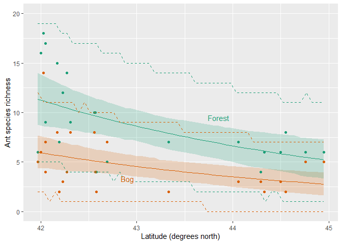
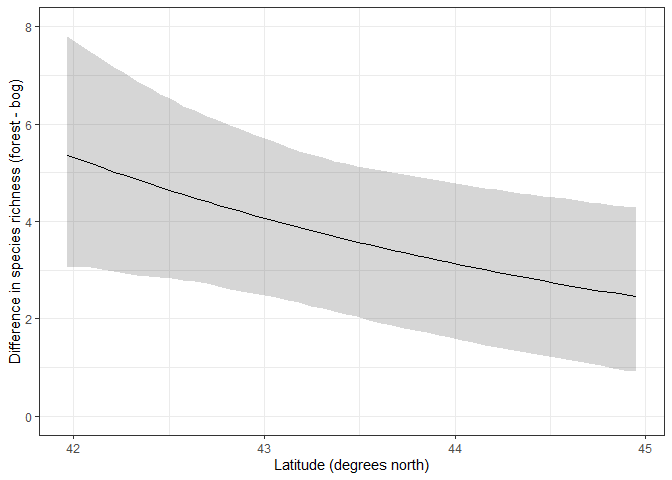

Ant data Generalized Linear Mixed Model
================
Brett Melbourne
11 Nov 2020 (minor updates 9 Nov 2021)

Third in a series of scripts to analyze the ant data described in
Ellison (2004). This script fits multilevel models to fully account for
the design structure. I will demonstrate both frequentist and Bayesian
approaches.

Set up for Bayesian analysis (order is important):

``` r
library(lme4)
library(ggplot2)
library(rstanarm)
options(mc.cores = parallel::detectCores())
theme_set(theme_grey()) #rstanarm overrides default ggplot theme: set it back
source("source/hpdi.R") #For calculating credible intervals
```

Read in and plot the data:

``` r
ant <- read.csv("data/ants.csv")
ant$habitat <- factor(ant$habitat)
ggplot(data=ant, mapping=aes(x=latitude, y=richness, col=habitat)) +
    geom_point()
```

<!-- -->

## GLMM

Recall that our first analysis was a GLM with Poisson distribution and
log link. The multilevel model will do the same. In the design, at each
site there are a pair of plots, one plot is a bog while the other is a
forest.


Thus, *site* is a grouping variable, while *plot* is the data scale.
*Habitat type* is a predictor at the plot scale. *Latitude* is a
predictor at the site scale.

``` r
ant$site <- factor(ant$site)
```

We’ll first try a maximum likelihood fit using `glmer` but we’ll see
that the algorithm fails to converge (although the failed fit is pretty
close):

``` r
glmerHxL <- glmer(richness ~ habitat + latitude + habitat:latitude + (1|site),
                 family=poisson, data=ant)
```

    ## Warning in checkConv(attr(opt, "derivs"), opt$par, ctrl = control$checkConv, :
    ## Model failed to converge with max|grad| = 0.0139534 (tol = 0.002, component 1)

    ## Warning in checkConv(attr(opt, "derivs"), opt$par, ctrl = control$checkConv, : Model is nearly unidentifiable: very large eigenvalue
    ##  - Rescale variables?;Model is nearly unidentifiable: large eigenvalue ratio
    ##  - Rescale variables?

We get a warning suggesting to rescale variables. If we look at the
correlation matrix (`Correlation of Fixed Effects`), we see a very high
correlation (-1.000) between the `intercept` and `latitude` parameters,
and the `habitat` and `habitat:latitude` parameters:

``` r
summary(glmerHxL)
```

    ## Generalized linear mixed model fit by maximum likelihood (Laplace
    ##   Approximation) [glmerMod]
    ##  Family: poisson  ( log )
    ## Formula: richness ~ habitat + latitude + habitat:latitude + (1 | site)
    ##    Data: ant
    ## 
    ##      AIC      BIC   logLik deviance df.resid 
    ##    216.4    225.3   -103.2    206.4       39 
    ## 
    ## Scaled residuals: 
    ##      Min       1Q   Median       3Q      Max 
    ## -1.28068 -0.61850 -0.02911  0.54244  1.94716 
    ## 
    ## Random effects:
    ##  Groups Name        Variance Std.Dev.
    ##  site   (Intercept) 0.04704  0.2169  
    ## Number of obs: 44, groups:  site, 22
    ## 
    ## Fixed effects:
    ##                        Estimate Std. Error z value Pr(>|z|)   
    ## (Intercept)             12.2065     4.7295   2.581  0.00985 **
    ## habitatforest            1.7596     5.3705   0.328  0.74319   
    ## latitude                -0.2483     0.1105  -2.248  0.02456 * 
    ## habitatforest:latitude  -0.0263     0.1256  -0.209  0.83415   
    ## ---
    ## Signif. codes:  0 '***' 0.001 '**' 0.01 '*' 0.05 '.' 0.1 ' ' 1
    ## 
    ## Correlation of Fixed Effects:
    ##             (Intr) hbttfr latitd
    ## habitatfrst -0.734              
    ## latitude    -1.000  0.735       
    ## hbttfrst:lt  0.734 -1.000 -0.735
    ## optimizer (Nelder_Mead) convergence code: 0 (OK)
    ## Model failed to converge with max|grad| = 0.0139534 (tol = 0.002, component 1)
    ## Model is nearly unidentifiable: very large eigenvalue
    ##  - Rescale variables?
    ## Model is nearly unidentifiable: large eigenvalue ratio
    ##  - Rescale variables?

So, indeed this correlation might be the problem. Scaling and centering
latitude fixes convergence.

``` r
ant$latitude_s <- scale(ant$latitude)
glmerHxL <- glmer(richness ~ habitat + latitude_s + habitat:latitude_s + (1|site),
                 family=poisson, data=ant)
```

In the summary, we see we have a random effect term: the variance at the
site scale, which is quite small.

``` r
summary(glmerHxL)
```

    ## Generalized linear mixed model fit by maximum likelihood (Laplace
    ##   Approximation) [glmerMod]
    ##  Family: poisson  ( log )
    ## Formula: richness ~ habitat + latitude_s + habitat:latitude_s + (1 | site)
    ##    Data: ant
    ## 
    ##      AIC      BIC   logLik deviance df.resid 
    ##    216.4    225.3   -103.2    206.4       39 
    ## 
    ## Scaled residuals: 
    ##      Min       1Q   Median       3Q      Max 
    ## -1.28067 -0.61790 -0.02882  0.54285  1.94512 
    ## 
    ## Random effects:
    ##  Groups Name        Variance Std.Dev.
    ##  site   (Intercept) 0.04703  0.2169  
    ## Number of obs: 44, groups:  site, 22
    ## 
    ## Fixed effects:
    ##                          Estimate Std. Error z value Pr(>|z|)    
    ## (Intercept)                1.5239     0.1111  13.713   <2e-16 ***
    ## habitatforest              0.6285     0.1240   5.069    4e-07 ***
    ## latitude_s                -0.2666     0.1182  -2.255   0.0241 *  
    ## habitatforest:latitude_s  -0.0271     0.1343  -0.202   0.8401    
    ## ---
    ## Signif. codes:  0 '***' 0.001 '**' 0.01 '*' 0.05 '.' 0.1 ' ' 1
    ## 
    ## Correlation of Fixed Effects:
    ##             (Intr) hbttfr lttd_s
    ## habitatfrst -0.726              
    ## latitude_s   0.210 -0.195       
    ## hbttfrst:l_ -0.192  0.274 -0.735

Let’s compare to the fit without the site grouping structure. We see
that parameter estimates are almost the same.

``` r
summary(glm(richness ~ habitat + latitude_s + habitat:latitude_s,
    family=poisson, data=ant))
```

    ## 
    ## Call:
    ## glm(formula = richness ~ habitat + latitude_s + habitat:latitude_s, 
    ##     family = poisson, data = ant)
    ## 
    ## Deviance Residuals: 
    ##     Min       1Q   Median       3Q      Max  
    ## -2.1562  -0.7929  -0.0332   0.8516   2.7420  
    ## 
    ## Coefficients:
    ##                          Estimate Std. Error z value Pr(>|z|)    
    ## (Intercept)               1.54619    0.10038  15.404  < 2e-16 ***
    ## habitatforest             0.62826    0.12449   5.047 4.49e-07 ***
    ## latitude_s               -0.27937    0.11024  -2.534   0.0113 *  
    ## habitatforest:latitude_s -0.02807    0.13706  -0.205   0.8377    
    ## ---
    ## Signif. codes:  0 '***' 0.001 '**' 0.01 '*' 0.05 '.' 0.1 ' ' 1
    ## 
    ## (Dispersion parameter for poisson family taken to be 1)
    ## 
    ##     Null deviance: 102.763  on 43  degrees of freedom
    ## Residual deviance:  50.242  on 40  degrees of freedom
    ## AIC: 218.6
    ## 
    ## Number of Fisher Scoring iterations: 4

So, why should we include the grouping term? First, because it is part
of the sample design. Thus, we know it is a contributing factor. This is
already a fact of the design and we can’t explain it away, for example,
with a non-significant hypothesis test for an effect of site. Second, we
see that the autocorrelation due to site has an effect on the
uncertainty of the latitude parameter. The mixed effects model estimates
more uncertainty in the latitude parameter, and a larger p-value for its
null hypothesis test. This is because there is effectively less
replication of latitude because latitude occurs at the site scale and
plots within sites are pseudoreplicates with respect to latitude.

Now turning to the Bayesian model. We have the same likelihood but we
now have weakly informative priors as well (using here the sensible
default priors). If we did this analysis with the scaled latitude
variable we would see that the Bayesian analysis is substantially
similar to the frequentist one. However, recall that in `rstanarm`, the
predictor variables are rescaled automatically, so we’ll use the
unscaled latitude variable for convenience as it will return results on
the original scale, saving us from carrying out the back-conversions.

``` r
bayesHxL <- stan_glmer(richness ~ habitat + latitude + habitat:latitude + (1|site), 
                       family=poisson, data=ant)
print(summary(bayesHxL)[,c("mean","sd","n_eff","Rhat")], digits=3)
```

    ##                                          mean     sd n_eff  Rhat
    ## (Intercept)                          1.29e+01 4.0687  2087 1.001
    ## habitatforest                        6.75e-01 3.0531  2333 1.000
    ## latitude                            -2.65e-01 0.0950  2095 1.001
    ## habitatforest:latitude              -7.44e-04 0.0715  2337 1.000
    ## b[(Intercept) site:ARC]              3.00e-02 0.1793  4292 1.000
    ## b[(Intercept) site:BH]               8.40e-02 0.1742  3364 1.000
    ## b[(Intercept) site:CAR]              1.09e-01 0.2156  3194 1.000
    ## b[(Intercept) site:CB]              -1.17e-01 0.1860  3499 1.000
    ## b[(Intercept) site:CHI]             -6.08e-02 0.2078  3369 1.000
    ## b[(Intercept) site:CKB]              3.59e-01 0.2060  2033 1.002
    ## b[(Intercept) site:COL]              4.20e-02 0.2039  3494 1.001
    ## b[(Intercept) site:HAW]             -2.86e-01 0.2294  2577 1.001
    ## b[(Intercept) site:HBC]              1.20e-01 0.1795  2927 1.001
    ## b[(Intercept) site:MOL]             -7.69e-03 0.2004  3598 1.001
    ## b[(Intercept) site:MOO]              9.49e-02 0.2029  3006 0.999
    ## b[(Intercept) site:OB]              -3.72e-02 0.1744  4124 1.000
    ## b[(Intercept) site:PEA]             -9.88e-02 0.2074  3840 1.000
    ## b[(Intercept) site:PK]              -2.26e-01 0.2094  2802 1.002
    ## b[(Intercept) site:QP]              -2.77e-02 0.1793  4021 0.999
    ## b[(Intercept) site:RP]               1.69e-01 0.1860  2840 1.000
    ## b[(Intercept) site:SKP]              1.77e-01 0.1813  2845 1.000
    ## b[(Intercept) site:SNA]             -8.53e-03 0.1962  4626 1.000
    ## b[(Intercept) site:SPR]             -1.10e-01 0.1983  3767 1.000
    ## b[(Intercept) site:SWR]              4.85e-02 0.1718  3352 1.000
    ## b[(Intercept) site:TPB]             -1.89e-01 0.1987  3487 1.000
    ## b[(Intercept) site:WIN]             -7.82e-02 0.1849  4054 1.000
    ## Sigma[site:(Intercept),(Intercept)]  6.59e-02 0.0485  1545 1.003
    ## mean_PPD                             7.02e+00 0.5674  5388 0.999
    ## log-posterior                       -1.39e+02 5.0570   986 1.006

Inspect diagnostics of the fit

``` r
launch_shinystan(bayesHxL)
```

In particular, the posterior distributions for the linear coefficients

are all nicely symmetric, as expected for this type of model.

We could next form credible intervals and prediction intervals but we’ll
defer that to the overdispersed model below.

## Overdispersed model

In the Poisson model, the variance is by definition equal to the mean.
What if there is more variance than this? This situation is called
overdispersion. We can include any extra variance by using a plot level
error term.

First define a plot-level indicator. Plot is the lowest level in this
dataset, so this is effectively the row number of the dataset.

``` r
ant$plot <- factor(1:nrow(ant))
#ant$plot <- 1:nrow(ant) #works just as well not as factor
```

Fit the mixed effects model now including the plot random effect. The
overdispersed GLMM using `glmer` with the unstandardized latitude again
fails to converge.

``` r
glmer_odHxL <- glmer(richness ~ habitat + latitude + habitat:latitude + (1|site) + (1|plot),
                        family=poisson, data=ant)
```

    ## Warning in checkConv(attr(opt, "derivs"), opt$par, ctrl = control$checkConv, :
    ## Model failed to converge with max|grad| = 0.00686684 (tol = 0.002, component 1)

    ## Warning in checkConv(attr(opt, "derivs"), opt$par, ctrl = control$checkConv, : Model is nearly unidentifiable: very large eigenvalue
    ##  - Rescale variables?;Model is nearly unidentifiable: large eigenvalue ratio
    ##  - Rescale variables?

Unfortunately, the overdispersed GLMM using `glmer` with scaled latitude
also fails to end in a successful fit, now for a different reason.

``` r
ant$latitude_s <- scale(ant$latitude)
glmer_odHxL_s <- glmer(richness ~ habitat + latitude_s + habitat:latitude_s + (1|site) + (1|plot),
      family=poisson, data=ant)
```

    ## boundary (singular) fit: see ?isSingular

Failure to fit often happens with `glmer`. In this case, it’s because
the overdispersion variance is close to zero (i.e. near the boundary of
parameter space) and the training algorithm is not coping with that. The
best we can do for a maximum likelihood fit is to assume the
overdispersion term is close enough to zero to not matter and thus leave
it out of the model.

We don’t have any such problems with the Bayesian model, which takes the
overdispersion term in stride (the prior regularizes the estimate).

``` r
bayes_odHxL <- stan_glmer(richness ~ habitat + latitude + habitat:latitude + (1|site) + (1|plot),
                        family=poisson, data=ant)
print(summary(bayes_odHxL)[,c("mean","sd","n_eff","Rhat")], digits=3)
```

    ##                                          mean     sd n_eff  Rhat
    ## (Intercept)                          1.29e+01 3.8617  2638 1.001
    ## habitatforest                        6.77e-01 2.9268  2304 1.001
    ## latitude                            -2.64e-01 0.0900  2649 1.001
    ## habitatforest:latitude              -8.42e-04 0.0684  2302 1.001
    ## b[(Intercept) plot:1]               -6.22e-02 0.1465  2466 1.000
    ## b[(Intercept) plot:2]                4.99e-02 0.1360  2527 1.000
    ## b[(Intercept) plot:3]                4.66e-02 0.1390  2386 1.001
    ## b[(Intercept) plot:4]                5.88e-02 0.1355  2447 1.000
    ## b[(Intercept) plot:5]               -1.89e-02 0.1232  3974 0.999
    ## b[(Intercept) plot:6]                4.16e-02 0.1333  2988 1.000
    ## b[(Intercept) plot:7]               -3.55e-02 0.1312  2639 1.000
    ## b[(Intercept) plot:8]                2.15e-02 0.1268  4258 0.999
    ## b[(Intercept) plot:9]                4.22e-02 0.1324  3179 0.999
    ## b[(Intercept) plot:10]              -2.46e-02 0.1247  4222 1.000
    ## b[(Intercept) plot:11]              -4.74e-03 0.1240  4711 1.000
    ## b[(Intercept) plot:12]               6.70e-03 0.1293  4589 1.000
    ## b[(Intercept) plot:13]              -6.05e-02 0.1397  2202 1.001
    ## b[(Intercept) plot:14]              -5.92e-02 0.1398  2905 1.000
    ## b[(Intercept) plot:15]              -2.39e-03 0.1283  4221 1.000
    ## b[(Intercept) plot:16]               6.24e-03 0.1279  4889 1.000
    ## b[(Intercept) plot:17]              -2.83e-02 0.1323  3510 0.999
    ## b[(Intercept) plot:18]               9.94e-04 0.1258  4146 1.000
    ## b[(Intercept) plot:19]              -1.19e-03 0.1289  4846 1.000
    ## b[(Intercept) plot:20]               3.22e-02 0.1306  3988 1.000
    ## b[(Intercept) plot:21]               2.19e-03 0.1313  4240 1.000
    ## b[(Intercept) plot:22]               8.56e-03 0.1332  3712 0.999
    ## b[(Intercept) plot:23]              -7.46e-03 0.1343  4638 1.001
    ## b[(Intercept) plot:24]              -5.49e-03 0.1309  4338 1.000
    ## b[(Intercept) plot:25]               9.90e-02 0.1679  1559 1.001
    ## b[(Intercept) plot:26]               5.86e-03 0.1323  4908 1.000
    ## b[(Intercept) plot:27]              -2.39e-02 0.1353  4121 1.001
    ## b[(Intercept) plot:28]               2.74e-02 0.1324  3751 0.999
    ## b[(Intercept) plot:29]              -5.01e-02 0.1431  2646 1.000
    ## b[(Intercept) plot:30]              -4.32e-02 0.1411  3453 0.999
    ## b[(Intercept) plot:31]              -2.83e-02 0.1353  4687 1.000
    ## b[(Intercept) plot:32]               3.67e-02 0.1371  4284 1.000
    ## b[(Intercept) plot:33]               4.00e-02 0.1346  3650 1.001
    ## b[(Intercept) plot:34]              -1.73e-02 0.1335  4885 1.000
    ## b[(Intercept) plot:35]              -4.26e-02 0.1401  2892 1.000
    ## b[(Intercept) plot:36]               3.64e-02 0.1341  3656 1.000
    ## b[(Intercept) plot:37]              -3.06e-02 0.1402  3630 0.999
    ## b[(Intercept) plot:38]              -1.14e-02 0.1401  4305 1.000
    ## b[(Intercept) plot:39]              -1.50e-03 0.1363  4246 1.000
    ## b[(Intercept) plot:40]              -2.08e-02 0.1366  4058 1.000
    ## b[(Intercept) plot:41]              -7.67e-03 0.1350  4398 0.999
    ## b[(Intercept) plot:42]              -2.31e-02 0.1397  4696 1.001
    ## b[(Intercept) plot:43]               3.34e-02 0.1413  3442 1.000
    ## b[(Intercept) plot:44]               3.62e-02 0.1456  3396 1.001
    ## b[(Intercept) site:ARC]              3.15e-02 0.1689  4343 1.000
    ## b[(Intercept) site:BH]               7.25e-02 0.1753  3514 0.999
    ## b[(Intercept) site:CAR]              8.63e-02 0.1989  3672 1.000
    ## b[(Intercept) site:CB]              -9.12e-02 0.1774  3670 1.001
    ## b[(Intercept) site:CHI]             -4.71e-02 0.1841  4226 1.001
    ## b[(Intercept) site:CKB]              2.98e-01 0.2155  1350 1.002
    ## b[(Intercept) site:COL]              3.08e-02 0.1929  4125 1.000
    ## b[(Intercept) site:HAW]             -2.37e-01 0.2194  1784 1.000
    ## b[(Intercept) site:HBC]              9.78e-02 0.1756  3165 1.000
    ## b[(Intercept) site:MOL]             -2.03e-03 0.1875  4213 1.000
    ## b[(Intercept) site:MOO]              7.75e-02 0.1960  3535 1.001
    ## b[(Intercept) site:OB]              -3.22e-02 0.1678  4617 0.999
    ## b[(Intercept) site:PEA]             -8.48e-02 0.2004  3630 0.999
    ## b[(Intercept) site:PK]              -1.85e-01 0.2074  2401 1.000
    ## b[(Intercept) site:QP]              -2.38e-02 0.1744  4502 1.000
    ## b[(Intercept) site:RP]               1.41e-01 0.1807  2224 1.000
    ## b[(Intercept) site:SKP]              1.46e-01 0.1806  2497 1.000
    ## b[(Intercept) site:SNA]             -2.64e-03 0.1844  4573 1.000
    ## b[(Intercept) site:SPR]             -8.94e-02 0.1886  3119 1.000
    ## b[(Intercept) site:SWR]              4.16e-02 0.1755  4746 1.000
    ## b[(Intercept) site:TPB]             -1.49e-01 0.1921  2834 1.001
    ## b[(Intercept) site:WIN]             -6.19e-02 0.1808  4451 1.001
    ## Sigma[plot:(Intercept),(Intercept)]  2.07e-02 0.0274  1267 1.002
    ## Sigma[site:(Intercept),(Intercept)]  5.60e-02 0.0482  1296 1.002
    ## mean_PPD                             7.02e+00 0.5633  4996 0.999
    ## log-posterior                       -2.04e+02 7.1839  1201 1.003

Inspecting the posterior distribution for the parameters reveals nice
symmetric distributions, except for the Sigma parameters (variances of
the random effects), which is expected. Sigma\_plot in particular has a
high probability mass near zero.

``` r
launch_shinystan(bayes_odHxL)
```

## Intervals

The code for the GLMM is substantially the same as the GLM. First form a
new dataset for prediction.

``` r
newd <- data.frame(latitude=rep( seq(min(ant$latitude), max(ant$latitude), 
                                      length.out=50), 2 ),
                   habitat=factor(rep(c("bog","forest"), each=50)))
```

Then derive samples for the posterior distribution of the inverse link
function,
i.e. Dist(),
which we’ll call `pmu`. In the GLMM we can choose whether we want
predictions to include the specific grouping terms or not (in other
words, do we want to predict for a specific site?). Here, we want to
predict for generic new sites, so we don’t include the specific sites.
To do that, we use the argument `re.form=NA`, which means “don’t form
the random effects”).

``` r
pmu <- posterior_linpred(bayes_odHxL, transform=TRUE, re.form=NA, newdata=newd)
```

    ## Instead of posterior_linpred(..., transform=TRUE) please call posterior_epred(), which provides equivalent functionality.

This is a matrix with samples in rows and the variable combinations in
columns. The estimated means are then:

``` r
mnmu <- colMeans(pmu)
```

and the credible intervals for the mean are:

``` r
regression_intervals <- t(apply(pmu, 2, hpdi))
colnames(regression_intervals) <- c("mulo95","muhi95")
```

For predictions, first derive samples for the posterior predictive
distribution, which we’ll call ppd:

``` r
ppd <- posterior_predict(bayes_odHxL, re.form=NA, newdata=newd)
```

and the prediction intervals (here CPI) are then:

``` r
prediction_intervals <- t(apply(ppd, 2, quantile, prob=c(0.025,0.975)))
colnames(prediction_intervals) <- c("ppdlo95","ppdhi95")
```

The plot shows that the credible intervals for the means are a little
wider than the fit that did not include the site-level grouping term or
the overdispersion term (compare to `09_8_ants_bayesian_GLM.md`).

``` r
mcpreds_df <- cbind(newd,mnmu,regression_intervals,prediction_intervals)
ggplot() +
    geom_ribbon(data=mcpreds_df, 
        mapping=aes(x=latitude, ymin=mulo95, ymax=muhi95, fill=habitat),
        alpha=0.2, show.legend=FALSE) +
    geom_point(data=ant, 
        mapping=aes(x=latitude, y=richness, col=habitat),
        show.legend=FALSE) +
    geom_line(data=mcpreds_df,
        mapping=aes(x=latitude, y=mnmu, col=habitat),
        show.legend=FALSE) +
    geom_line(data=mcpreds_df,
        mapping=aes(x=latitude, y=ppdlo95, col=habitat),
        lty=2, show.legend=FALSE) +
    geom_line(data=mcpreds_df,
        mapping=aes(x=latitude, y=ppdhi95, col=habitat),
        lty=2, show.legend=FALSE) +
    geom_text(mapping=aes(x=42.9, y=3.3, label="Bog"), col="#d95f02") +
    geom_text(mapping=aes(x=43.85, y=9.5, label="Forest"), col="#1b9e77") +
    scale_fill_manual(values=c("#d95f02","#1b9e77")) +
    scale_color_manual(values=c("#d95f02","#1b9e77")) +
    ylim(0,20) +
    xlab("Latitude (degrees north)") +
    ylab("Ant species richness") 
```

<!-- -->

To derive the differences between forest and bog across latitude using
the output from the `posterior_linpred` convenience function we have to
consider how we set up the `newd` dataframe. We asked for 50 increments
of bog across latitude followed by 50 increments of forest. So to obtain
derived samples of the difference between forest and bog we’ll subtract
the first 50 columns from the second 50 columns of the `pmu` matrix.

``` r
diff <- pmu[,51:100] - pmu[,1:50]
diff_mn <- colMeans(diff)
diff_cpi <- t(apply(diff, 2, quantile, prob=c(0.025,0.975)))
colnames(diff_cpi) <- c("difflo95","diffhi95")
diff_df <- data.frame(cbind(diff_mn, diff_cpi, latitude=newd$latitude[1:50]))
```

The plot shows similar estimates compared to the fit that did not
include the site-level grouping term or the overdispersion term (compare
to `09_8_ants_bayesian_GLM.md`). However, the decline with latitude is a
little less steep and the credible interval is a little wider after
accounting for the spatial structure and overdispersion.

``` r
ggplot(data=diff_df) +
    geom_ribbon(mapping=aes(x=latitude, ymin=difflo95, ymax=diffhi95),
        alpha=0.2) +
    geom_line(mapping=aes(x=latitude, y=diff_mn)) +
    ylim(0,8) +
    xlab("Latitude (degrees north)") +
    ylab("Difference in species richness (forest - bog)") +
    theme_bw()
```

<!-- -->
