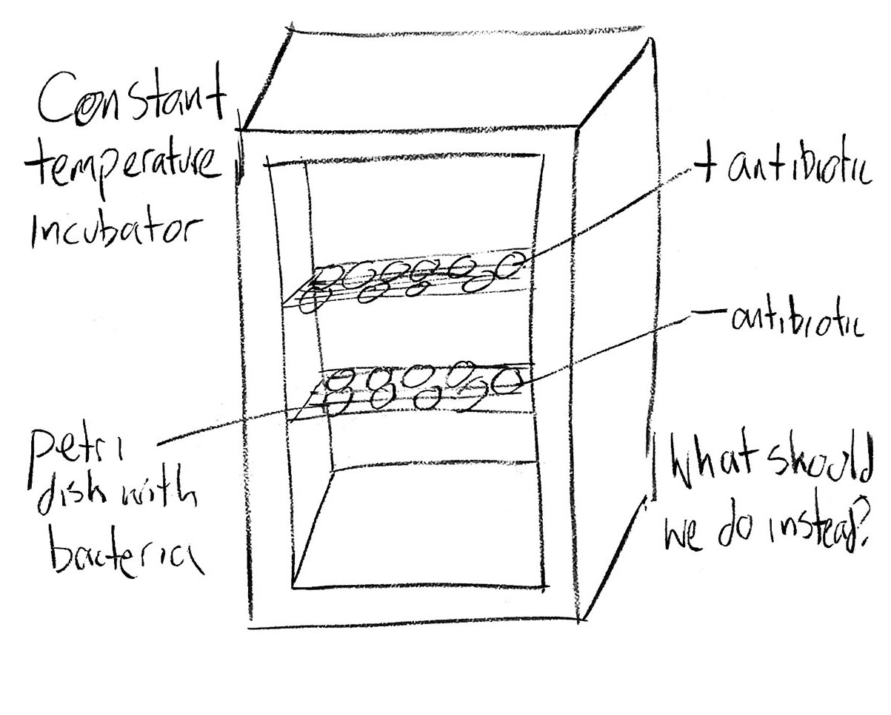

### Week 13: Preclass preparation for Mon-Wed

Binomial distribution, practice multilevel experimental design, and fitting the model in your independent project. I suggest at least 1-3 for Monday, 4-5 for Wednesday, and 6 as continuing progress on your individual project.

#### 1. Git: collaboration

Git and GitHub are powerful tools for collaborating on code. In this class, you'll at least need to know how to get and incorporate my feedback on your code from GitHub.

[git08_collaborating.md](skills_tutorials/git08_collaborating.md)

#### 2. Adding images to markdown documents

[repsci06_markdown_images.md](skills_tutorials/repsci06_markdown_images.md)

#### 3. Binomial distribution and others

We will introduce binomial models on Monday. Read the short section on the binomial distribution, from Chapter 4 of Ben Bolker's book. This reading is in the [Google Drive](https://drive.google.com/drive/folders/1ZMEFNuh36pyWLbFx9YBeMjLZCp7orylo). The section called *Bestiary of distributions* is a handy reference. If you haven't already read it from the earlier homework, it is worth reading through the whole of *Bestiary of distributions* to get a sense of what distributions might be relevant to your individual project.

#### 4. Study design

I have posted reading to Google Drive (Texts):

* Quinn & Keough Ch 7 Design and Power Analysis
  * There are better ways to assess the quality of a design than classical power analysis, so I have only included material on design (not power analysis)
  * Sections on replication, controls, and randomization are especially relevant

#### 5. Fix the design and write the model

The following is an experiment to test the effect of an antibiotic on bacterial growth. Petri plates of bacteria are placed inside a constant temperature incubator. Plates on the top shelf have the antibiotic, whereas those on the bottom shelf don't have it. This design is fatally flawed and confounded.

1. What is the problem? i.e. describe the problem and explain how it could lead to a wrong inference.
2. What should we do instead? i.e. redesign the experiment. The constraints are that we have to use the one incubator, and we have 20 total petri dishes. Include a sketch of your new design (in the style of the data structure sketches we did for radon and ants).
3. Write down the math for the model that describes the improved design. Use LaTeX. You will have to consider what to assume for the stochastic components.
4. Write down the R code for, say, `lmer()` that would fit the model in (3).
5. Produce a markdown (`.md`) document that includes 1-4 and **push your answers to GitHub**

#### 6. Have a go at fitting a multilevel model in your individual project

Now that you have scales of predictors and grouping variables identified, and have figured out the math of your model, fit the model in a Bayesian framework using `stan_lmer()` or `stan_glmer()` from `rstanarm`. If your project is not suitable for `lmer`/`glmer` let me know so we can figure out an alternative. You might find it convenient to prototype (i.e. quickly fit) using the frequentist`lmer()` or `glmer()` from `lme4` if possible. However, quite often `lmer()` or `glmer()` will choke on typical ecological datasets (i.e. has convergence issues or worse). As with the Bayesian MCMC algorithm, it often helps a maximum likelihood optimization algorithm to converge if you first standardize the predictors but sometimes even that doesn't help and the Bayesian model might be your only option. **Push to GitHub**

