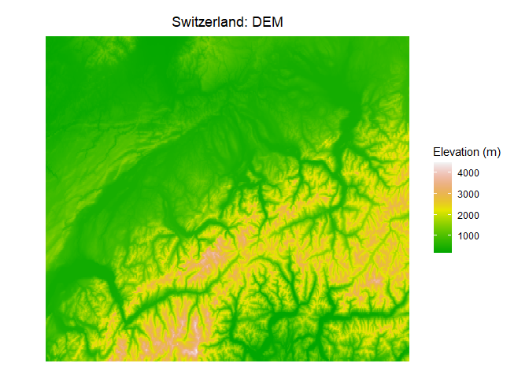

Binomial GLM. Swiss breeding bird survey example
================
Brett Melbourne
16 Nov 2020

Apologies for lack of ggplot here. I didn’t have time to convert this
example. It’s always good to know base plot too!

Willow tit distribution with altitude. This is an example of a nonlinear
biological model with a binomial distribution. The model is logit-linear
and together with the binomial distribution, this combination is the
special case of logistic regression. The data are occurrence (presence-
absence) of the willow tit. This example is from Royle JA & Dorazio RM
(2008) Hierarchical Modeling and Inference in Ecology, p 87. Altitude
data are from eros.usgs.gov. To exactly replicate the analysis on p 87,
first rescale the elevation data: elev &lt;- scale(elev). I don’t do
that here in order to show another strategy for fixing an algorithm -
i.e. rescaling parameters.

Read in and plot elevation data for Switzerland.

``` r
swissmap <- as.matrix(read.csv("data/switzerland.csv",header=FALSE))
swtzrlndElev <- t(swissmap)[,246:1] #Rotate matrix for plotting
```

``` r
par(mar=c(0.1,0.1,0.1,0.1),oma=c(3,1,3,8))
cols <- c(terrain.colors(22))
brks <- c(seq(100,4500,by=200))
image(swtzrlndElev,col=cols,breaks=brks,axes=FALSE)
box()
mtext("Switzerland - elevation in metres",line=1)
# Add a legend
par(mar=c(0.1,0.1,0.1,3.1),oma=c(3,43,3,1),new=TRUE)
z <- matrix(1,nrow=length(cols),ncol=1)
barplot(z,col=cols,axes=FALSE)
axis(4, at = seq(0,22,2),labels=brks[seq(1,23,2)],lwd=0,lwd.ticks=1,las=1)
```

<!-- -->

Read in the bird data

``` r
willowtit_data <- read.csv("data/wtmatrix.csv")  #Dataset from Royle & Dorazio
occ <- willowtit_data[,"y.1"]  #The occurrence data
elev <- willowtit_data[,"elev"]
cbind(occ,elev)[1:30,] #Take a look at the first 30 rows of data
```

    ##       occ elev
    ##  [1,]   0  420
    ##  [2,]   0  450
    ##  [3,]   0 1050
    ##  [4,]   0 1110
    ##  [5,]   0  510
    ##  [6,]   0  630
    ##  [7,]   0  590
    ##  [8,]   0  530
    ##  [9,]   1 1140
    ## [10,]   0  770
    ## [11,]   0 1220
    ## [12,]   0  460
    ## [13,]   0 1010
    ## [14,]   0  760
    ## [15,]   1 1300
    ## [16,]   1 1270
    ## [17,]   0  380
    ## [18,]   1  550
    ## [19,]   0  390
    ## [20,]   0 1380
    ## [21,]   0  530
    ## [22,]   0 1190
    ## [23,]   1 1490
    ## [24,]   0  920
    ## [25,]   0  620
    ## [26,]   0  540
    ## [27,]   1  820
    ## [28,]   1 1220
    ## [29,]   1 1180
    ## [30,]   0  730

Plot the data

``` r
plot(elev,occ,xlab="Elevation (m)",ylab="Occurrence",
     main="Willow tits in Switzerland")
```

<!-- -->

``` r
occtab <- table(occ,cut(elev,breaks=seq(0,3000,by=500)))
freq <- occtab[2,]/colSums(occtab)
```

… also summarized by binning into 500 m increments

``` r
plot(seq(250,3000,by=500),freq,xlim=c(0,3000),xlab="Elevation (m)",
    ylab="Frequency of occurrence",type="o")
abline(v=seq(0,3000,by=500),col="gray",lty=2)
mtext("Relationship appears humped",line=1)
```

<!-- -->

## Binomial GLM the hard way

We’ll first do this the hard way by coding the likelihood and optimizing
directly. I’m doing this to show the structure of the analysis and the
general algorithm. You won’t do this for ordinary binomial GLMs like
this example because you can use the one-line tool `glm()` that does the
same thing and `stan_glm()` for the Bayesian version with sensible
priors (see further below).

### The linear predictor

Here we’ll allow for the distribution of willow tits with elevation to
be hump shaped. There is an optimal elevation for willow tits. To model
a hump, we relate the logit of the probability of occurrence, p, to
elevation by a quadratic function:

 ) = \beta_0 + \beta_1 elev + \beta_2 elev^2")

The probability of occurrence of the willow tit for a sample location is
then obtained from the inverse function of the linear predictor, in this
case the antilogit. Notice that the logit link function ranges from -INF
to +INF on the scale of the linear predictor but is bounded 0-1 on the
probability scale. This function is calculating the predicted
probability.

``` r
p_pred_quadratic  <- function( b0, b1, b2, elev ) {
    lp <- b0 + b1 * elev + b2 * elev^2   #logit p
    prob <- exp(lp)/(1+exp(lp))          #antilogit
    return(prob)
}
```

### Negative log likelihood function

… for logit-quadratic model with binomial distribution. A log scale
direct search showed that

is several orders of magnitude smaller than the other parameters.
Optimization is better behaved if all parameters are on similar scales.
We use a simple trick here, which is to pass nll a parameter on a
similar scale to the others but then rescale the parameter in the nll
function.

``` r
quadratic_nll <- function(p,occ,elev){
    b2 <- p[3] * 1e-06  #Rescale
    ppred <- p_pred_quadratic(b0=p[1],b1=p[2],b2,elev)
    nll <- -sum(dbinom(occ,size=1,prob=ppred,log=TRUE))
    return(nll)
}
```

I first did a bit of a grid search to get some idea of the likelihood
surface and that suggested these starting values for `optim()`.

``` r
par <- c(-8,0.02,-3)
```

Now find the MLE using `optim()` with the Nelder-Mead algorithm

``` r
fit_quadratic <- optim(par,quadratic_nll,occ=occ,elev=elev)
```

Here are the results of the fit.

is par\[3\]\*1e-06. Convergence was confirmed.

``` r
fit_quadratic
```

    ## $par
    ## [1] -8.37878883  0.01115711 -3.50844525
    ## 
    ## $value
    ## [1] 105.6839
    ## 
    ## $counts
    ## function gradient 
    ##      246       NA 
    ## 
    ## $convergence
    ## [1] 0
    ## 
    ## $message
    ## NULL

Plot the fitted model with the data

``` r
plot(elev,occ,xlab="Elevation",ylab="Probability of occurrence")
elevxx <- seq(min(elev),max(elev), length.out=100) #grid for the x axis
predp <- p_pred_quadratic(fit_quadratic$par[1],fit_quadratic$par[2],
                          fit_quadratic$par[3]*1e-06,elevxx)
lines(elevxx,predp)
points(seq(250,3000,by=500),freq,col="red")
legend(2000,0.9,c("Data","Freq, 500m bins"),col=c("black","red"),pch=1)
```

<!-- -->

### Test of the hump hypothesis

A brief preview of model selection. One approach to model selection,
arguably the traditional approach, is the frequentist null hypothesis
significance test (NHST). An alternative (null) model is that there is
no hump, only a monotonically increasing or decreasing probability with
elevation. In that case, a suitable model is
")
related to elevation by a linear function:

 ) = \beta_0 + \beta_1 elev")

Note that the backtransformed function

")

is still a nonlinear function (sigmoid).

``` r
p_pred_linear  <- function( b0, b1, elev ) {
    lp <- b0 + b1 * elev            #logit probability
    prob <- exp(lp)/(1+exp(lp))     #antilogit
    return(prob)
}

linear_nll <- function( p, occ, elev ) {
    ppred <- p_pred_linear(b0=p[1],b1=p[2],elev)
    nll <- -sum(dbinom(occ,size=1,prob=ppred,log=TRUE))
    return(nll)
}
par <- c(-3,0.001) #Starting parameters from direct search
fit_linear <- optim(par,linear_nll,occ=occ,elev=elev)
fit_linear #Convergence is good.
```

    ## $par
    ## [1] -2.442180671  0.001180472
    ## 
    ## $value
    ## [1] 127.8825
    ## 
    ## $counts
    ## function gradient 
    ##       77       NA 
    ## 
    ## $convergence
    ## [1] 0
    ## 
    ## $message
    ## NULL

Plot the fitted reduced model (blue) with the data. It’s clear that the
hump model is a much better description of the data.

``` r
plot(elev,occ,xlab="Elevation",ylab="Probability of occurrence")
elevxx <- seq(min(elev),max(elev), length.out=100) #grid for the x axis
lines(elevxx,p_pred_linear(fit_linear$par[1],fit_linear$par[2],
                           elevxx),col="blue")
lines(elevxx,p_pred_quadratic(fit_quadratic$par[1],fit_quadratic$par[2],
                          fit_quadratic$par[3]*1e-06,elevxx))
points(seq(250,3000,by=500),freq,col="red")
legend(2000,0.9,c("Data","Freq, 500m bins"),col=c("black","red"),pch=1)
```

<!-- -->

The NHST is based on the frequentist likelihood ratio test. The deviance
(a scaled likelihood ratio) of the null model theoretically has a
chi-squared sampling distribution. The test clearly shows the hump is a
better model.

``` r
nll_H0 <- fit_linear$value
nll_H1 <- fit_quadratic$value
deviance <- 2 * ( nll_H0 - nll_H1 )
deviance
```

    ## [1] 44.39716

``` r
1 - pchisq(deviance,df=1)  #This is the P-value. Significant at alpha < 0.05.
```

    ## [1] 2.680756e-11

### Plot predictions as a map

… for the best fitting (quadratic) model

``` r
predp <- p_pred_quadratic(fit_quadratic$par[1],fit_quadratic$par[2],
                          fit_quadratic$par[3]*1e-06,swtzrlndElev)
#min(predp) #To get good bounds for the color scale
#max(predp)
```

``` r
par(mar=c(0.1,0.1,0.1,0.1),oma=c(3,1,3,8))
cols <- c(heat.colors(14))
brks <- c(seq(0,0.7,length.out=15))
image(predp,col=cols,breaks=brks,axes=FALSE)
box()
mtext("Predicted probability of willow tit occurrence",line=1)
# Legend
par(mar=c(0.1,0.1,0.1,3.1),oma=c(3,43,3,1),new=TRUE)
z <- matrix(1,nrow=length(cols),ncol=1)
barplot(z,col=cols,axes=FALSE)
axis(4, at = seq(0,14,2),labels=brks[seq(1,15,2)],lwd=0,lwd.ticks=1,las=1)
```

<!-- -->

### Built-in tools for GLMs

Here is the equivalent likelihood analysis using `glm()`.

``` r
glm_quadratic <- glm(occ ~ elev + I(elev^2), family=binomial) 
glm_linear <- glm(occ ~ elev, family=binomial)
```

Likelihood ratio test. Notice that the deviance and p value are the same
as the MLE analysis above. The residual deviance is 2X the nll
(e.g. compare 2\*nll\_H1 from above).

``` r
anova(glm_linear,glm_quadratic,test="Chisq")    
```

    ## Analysis of Deviance Table
    ## 
    ## Model 1: occ ~ elev
    ## Model 2: occ ~ elev + I(elev^2)
    ##   Resid. Df Resid. Dev Df Deviance Pr(>Chi)    
    ## 1       235     255.76                         
    ## 2       234     211.37  1   44.397 2.68e-11 ***
    ## ---
    ## Signif. codes:  0 '***' 0.001 '**' 0.01 '*' 0.05 '.' 0.1 ' ' 1

``` r
cbind(logLik(glm_linear),logLik(glm_quadratic)) #Log likelihoods, compare to nll_H0 and nll_H1
```

    ##           [,1]      [,2]
    ## [1,] -127.8825 -105.6838

``` r
glm_quadratic  #Residual deviance is 2*nll, compare 2*nll_H1 from above
```

    ## 
    ## Call:  glm(formula = occ ~ elev + I(elev^2), family = binomial)
    ## 
    ## Coefficients:
    ## (Intercept)         elev    I(elev^2)  
    ##  -8.397e+00    1.118e-02   -3.517e-06  
    ## 
    ## Degrees of Freedom: 236 Total (i.e. Null);  234 Residual
    ## Null Deviance:       282.3 
    ## Residual Deviance: 211.4     AIC: 217.4

The Bayesian version is

``` r
library(rstanarm)
options(mc.cores = parallel::detectCores())
stanfit <- stan_glm(occ ~ elev + I(elev^2), family=binomial, data=data.frame(occ,elev))
print(summary(stanfit)[,c("mean","sd","n_eff","Rhat")],digits=3)
```
