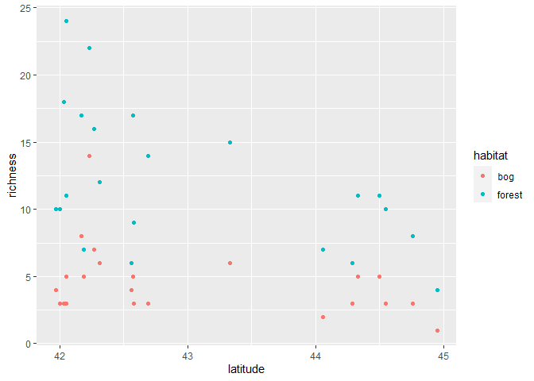

Ant data: simulating data to solidify understanding and test algorithms
================
Brett Melbourne
4 Dec 2021

``` r
library(lme4)
library(ggplot2)
library(rstanarm)
options(mc.cores = parallel::detectCores())
theme_set(theme_grey())
```

This is the fifth in a series of scripts to analyze the ant data
described in Ellison (2004). In this script we’re going to generate
simulated data to solidify our understanding of the model (the data
generating process) and to check that our model, training, and inference
algorithms are working as intended.

We’ll follow the general approach outlined in
[15\_2\_sim\_multilevel.Rmd](15_2_sim_multilevel.md) but this time for
the specific case of the ant data. We don’t want to get too complicated
right away, so we’ll pick one of the simpler models we’ve been
entertaining. We can increase complexity gradually as we need to.
Starting simple and building complexity is a good modeling strategy.
Thoroughly understanding a simpler model first will help us understand
more complex models as we build them.

We want to simulate the response variable (species richness) as a
function of the predictors. One of our most basic models is a
generalized linear model with a Poisson distribution for species
richness and log link with latitude and habitat type as linear
predictors. We also have a random effect of site. A site is a pair of
sampling plots, each plot with a different habitat type. We entertained
this model earlier in
[12\_3\_ants\_multilevel.R](12_3_ants_multilevel.md). We previously
looked in detail at the mathematical model in
[12\_4\_slides\_wed\_ants\_GLMM.pdf](12_4_slides_wed_ants_GLMM.pdf). The
hierarchical form of this model (with some minor notation changes to
improve clarity) is:

")  
![\\mathrm{ln}(\\mu\_i) = \\alpha\_{j\[i\]} + \\beta\_1 \\mathrm{forest}\_i + \\beta\_3 \\mathrm{forest}\_i \\times \\mathrm{latitude}\_{j\[i\]}](https://latex.codecogs.com/png.latex?%5Cmathrm%7Bln%7D%28%5Cmu_i%29%20%3D%20%5Calpha_%7Bj%5Bi%5D%7D%20%2B%20%5Cbeta_1%20%5Cmathrm%7Bforest%7D_i%20%2B%20%5Cbeta_3%20%5Cmathrm%7Bforest%7D_i%20%5Ctimes%20%5Cmathrm%7Blatitude%7D_%7Bj%5Bi%5D%7D "\mathrm{ln}(\mu_i) = \alpha_{j[i]} + \beta_1 \mathrm{forest}_i + \beta_3 \mathrm{forest}_i \times \mathrm{latitude}_{j[i]}")  
,\sigma_{\alpha}^2)")  
 = \beta_0 + \beta_2 \mathrm{latitude}_j")  

It would be simpler to simulate the additive decomposition form of this
model (see
[12\_4\_slides\_wed\_ants\_GLMM.pdf](12_4_slides_wed_ants_GLMM.pdf))
because it collapses some of the data generating processes into an
equivalent but simpler form. We’re going to use the above hierarchical
form of the model here because it is a more literal expression of our
concept for how the data are generated step by step, and so simulating
it will consolidate our understanding of our biologically-inspired
theory (or *story*) of the data generating process. In other words, the
data simulation will help us to think through the question of “does my
model tell my story for how I imagine the biology?”. To simulate data
for this model we just need to implement it as an algorithm in code.

The equations broadly say that there are four steps to generating
species richness, starting from line 4 of the equations and working back
to line 1. In pseudocode, our data story is as follows:

    for each site j
        latitude determines broad-scale richness (Eq. line 4)
        but there is some stochasticity about this (Eq. line 3)
        
    for each plot i
        habitat modifies local richness (Eq. line 2)
        then stochasticity determines the final richness (Eq. line 1)

So, we have a hierarchical and step-by-step concept for how biological
processes at different scales ultimately give rise to the number of ant
species at the scale of individual data points (plots). First, latitude
determines the big picture, then it is modified by habitat at smaller
scales, and stochasticity is important at both large and small scales.

To generate data then, broadly our data generating algorithm is:

    for each site j
        generate an expected ln(richness) based on latitude (Eq. line 4)
        generate stochasticity around this expectation (Eq. line 3)
        
    for each plot i
        generate an expected ln(richness) based on habitat type (Eq. line 2)
        generate richness with stochasticity (Eq. line 1)

The data are generated separately at the different scales, reflecting
our biological story.

Our intention is to match the study design of our real dataset, so we
want to use the predictor variables as they are in the real dataset:

``` r
ant <- read.csv("data/ants.csv")
```

Recall that we have 22 sites, each with an associated latitude, and at
each site we have both a forest and a bog sample plot:

``` r
ant[,c("site", "habitat", "latitude")]
```

    ##    site habitat latitude
    ## 1   TPB  forest    41.97
    ## 2   HBC  forest    42.00
    ## 3   CKB  forest    42.03
    ## 4   SKP  forest    42.05
    ## 5    CB  forest    42.05
    ## 6    RP  forest    42.17
    ## 7    PK  forest    42.19
    ## 8    OB  forest    42.23
    ## 9   SWR  forest    42.27
    ## 10  ARC  forest    42.31
    ## 11   BH  forest    42.56
    ## 12   QP  forest    42.57
    ## 13  HAW  forest    42.58
    ## 14  WIN  forest    42.69
    ## 15  SPR  forest    43.33
    ## 16  SNA  forest    44.06
    ## 17  PEA  forest    44.29
    ## 18  CHI  forest    44.33
    ## 19  MOL  forest    44.50
    ## 20  COL  forest    44.55
    ## 21  MOO  forest    44.76
    ## 22  CAR  forest    44.95
    ## 23  TPB     bog    41.97
    ## 24  HBC     bog    42.00
    ## 25  CKB     bog    42.03
    ## 26  SKP     bog    42.05
    ## 27   CB     bog    42.05
    ## 28   RP     bog    42.17
    ## 29   PK     bog    42.19
    ## 30   OB     bog    42.23
    ## 31  SWR     bog    42.27
    ## 32  ARC     bog    42.31
    ## 33   BH     bog    42.56
    ## 34   QP     bog    42.57
    ## 35  HAW     bog    42.58
    ## 36  WIN     bog    42.69
    ## 37  SPR     bog    43.33
    ## 38  SNA     bog    44.06
    ## 39  PEA     bog    44.29
    ## 40  CHI     bog    44.33
    ## 41  MOL     bog    44.50
    ## 42  COL     bog    44.55
    ## 43  MOO     bog    44.76
    ## 44  CAR     bog    44.95

We’re going to need some parameter values for the model. We could make
them up entirely, base them on prior experience or biological
plausibility, or base them on our real data. Here, from a plot of the
real data, I eyeballed mean richness values at latitudes 42 and 45 for
bog habitat to give these equations for the linear predictor (from line
4 of the mathematical model equation above):

 = \beta_0 + \beta_2 \times 42")  
 = \beta_0 + \beta_2 \times 45")

which I then solved by hand (2 equations, 2 unknowns) to give reasonable
values for

and
.
I did the same for forest habitat, where I discovered the slope was
about the same
(i.e. 
= 0). For

I thought 25% stochasticity was a good place to start based on my
knowledge of ecological processes; given the ln scale, that’s about
0.25. We could alternatively have used estimates from the fit of the
model we obtained in
[12\_3\_ants\_multilevel.R](12_3_ants_multilevel.md) but we don’t have
to fit a model to real data at this stage.

Now, let’s translate our pseudocode into R code, adding the necessary
detail from the equations plus some infrastructure (parameter values and
data structures), as well as vectorizing the for loops from our
pseudocode.

``` r
# Parameters
b_0 <- 11.5
b_1 <- 0.7
b_2 <- -0.231
b_3 <- 0
sigma_alpha <- 0.25

# Set up the study design the same as the real data:

# Site-scale variable (22 sites)
latitude <- ant$latitude[1:22]

# Plot-scale variables (44 plots, 2 per site)
j <- rep(1:22, 2) #site ID
forest <- ifelse(ant$habitat == "forest", 1, 0) #forest indicator

# Generate data:

# For each site, generate an expected ln(richness) based on latitude (Eq. line 4)
mu_alpha <- b_0 + b_2 * latitude

# For each site, generate stochasticity around this expectation (Eq. line 3)
# (note how this value will be the same for both plots at a site)
alpha <- rnorm(22, mu_alpha, sigma_alpha)

# For each plot, generate an expected ln(richness) based on habitat type (Eq. line 2)
# (we use j to extract the appropriate alpha and latitude values)
ln_mu <- alpha[j] + b_1 * forest + b_3 * forest * latitude[j]

# For each plot, generate richness with stochasticity (Eq. line 1)
# (we use the inverse link function to obtain mu)
y <- rpois(44, exp(ln_mu))

# Put in a data frame
sim_dat <- cbind(ant[,1:3], richness=y)
```

How do the simulated data look?

``` r
ggplot(data=sim_dat, mapping=aes(x=latitude, y=richness, col=habitat)) +
    geom_point()
```

<!-- -->

Not bad! It’s even quite like the real data. Now, if we fit the model to
these simulated data, can we recover the known parameters (i.e. the
parameter values we coded in)?

``` r
sim_dat$habitat <- factor(sim_dat$habitat)
sim_dat$site <- factor(sim_dat$site)
bayesHxL <- stan_glmer(richness ~ habitat + latitude + habitat:latitude + (1|site), 
                       family=poisson, data=sim_dat)
print(summary(bayesHxL)[,c("mean","sd","n_eff","Rhat")], digits=3)
```

    ##                                          mean     sd n_eff  Rhat
    ## (Intercept)                          1.14e+01 4.0813  1768 1.000
    ## habitatforest                        8.21e-01 2.8858  1741 1.001
    ## latitude                            -2.32e-01 0.0951  1770 1.001
    ## habitatforest:latitude               3.48e-03 0.0674  1739 1.001
    ## b[(Intercept) site:ARC]             -1.50e-02 0.1892  3824 0.999
    ## b[(Intercept) site:BH]              -2.67e-01 0.2132  3236 0.999
    ## b[(Intercept) site:CAR]             -2.41e-01 0.2559  3624 1.000
    ## b[(Intercept) site:CB]              -1.83e-01 0.2005  3648 1.000
    ## b[(Intercept) site:CHI]              1.65e-01 0.2174  3682 1.000
    ## b[(Intercept) site:CKB]              3.69e-02 0.1840  3620 0.999
    ## b[(Intercept) site:COL]              7.52e-02 0.2161  3623 1.000
    ## b[(Intercept) site:HAW]             -1.87e-01 0.2013  4342 0.999
    ## b[(Intercept) site:HBC]             -2.27e-01 0.2121  3157 1.000
    ## b[(Intercept) site:MOL]              1.86e-01 0.2232  3768 1.002
    ## b[(Intercept) site:MOO]              1.37e-02 0.2181  3294 1.000
    ## b[(Intercept) site:OB]               4.57e-01 0.1892  2751 1.001
    ## b[(Intercept) site:PEA]             -1.21e-01 0.2218  3746 1.000
    ## b[(Intercept) site:PK]              -2.36e-01 0.2051  3620 1.000
    ## b[(Intercept) site:QP]               1.44e-01 0.1870  3439 1.001
    ## b[(Intercept) site:RP]               1.66e-01 0.1878  3689 1.000
    ## b[(Intercept) site:SKP]              2.56e-01 0.1849  3195 1.001
    ## b[(Intercept) site:SNA]             -1.42e-01 0.2290  3644 1.001
    ## b[(Intercept) site:SPR]              2.11e-01 0.1919  3427 1.001
    ## b[(Intercept) site:SWR]              1.32e-01 0.1855  3900 1.000
    ## b[(Intercept) site:TPB]             -1.92e-01 0.1989  3520 1.000
    ## b[(Intercept) site:WIN]              2.77e-03 0.1942  4142 1.000
    ## Sigma[site:(Intercept),(Intercept)]  9.09e-02 0.0548  1442 1.001
    ## mean_PPD                             8.33e+00 0.6038  4407 1.000
    ## log-posterior                       -1.39e+02 4.9408   960 1.005

Comparing the relevant parameters in turn, we see that the estimated
values are close to the known values we coded in.

``` r
cbind(b_0, estimated=summary(bayesHxL)["(Intercept)","mean"])
```

    ##       b_0 estimated
    ## [1,] 11.5  11.41237

``` r
cbind(b_1, estimated=summary(bayesHxL)["habitatforest","mean"])
```

    ##      b_1 estimated
    ## [1,] 0.7 0.8207651

``` r
cbind(b_2, estimated=summary(bayesHxL)["latitude","mean"])
```

    ##         b_2  estimated
    ## [1,] -0.231 -0.2315649

``` r
cbind(b_3, estimated=summary(bayesHxL)["habitatforest:latitude","mean"])
```

    ##      b_3   estimated
    ## [1,]   0 0.003479979

``` r
cbind(sigma_alpha, estimated=sqrt(summary(bayesHxL)["Sigma[site:(Intercept),(Intercept)]","mean"]))
```

    ##      sigma_alpha estimated
    ## [1,]        0.25 0.3014313

This gives us confidence that 1) we understand our model (our intended
data generating process), 2) we’ve correctly translated the model into
`stan_glmer` syntax, and 3) the algorithms for training and inference
are working as expected. We should run the above code a number of times
to get a feeling for the variability in the data generating process and
how consistently the estimated parameters from model fitting compare to
the true values. The model fit from a single realization is not
necessarily going to be close to the known parameters.

We can do many things from here. We can try different parameter values
to test the model fitting or to explore how parameter values determine
the data generating process. For example, how does site scale
stochasticity influence the uncertainty of species richness at the plot
scale? We could add complexity to the model, for example by adding new
variables, or overdispersion. We could turn the model code into a
function so that we can easily change parameter values. We could run the
model many times and use a facet plot to visualize the variability in
stochastic realizations of the data generating process and the resulting
model fits. Simulating data is a powerful approach to clarify our
scientific thinking, build our understanding of our model and
quantitative methods, and to test our code and algorithms.
