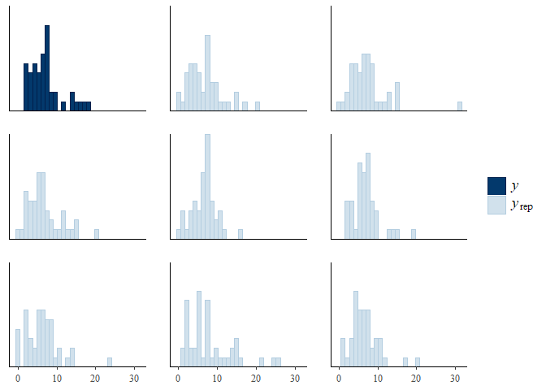
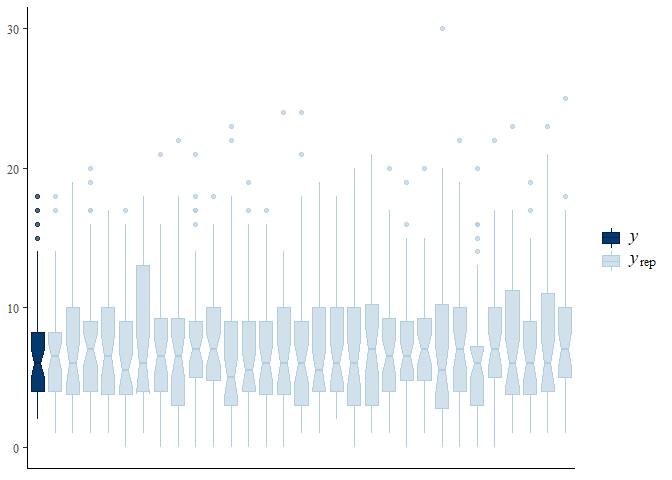
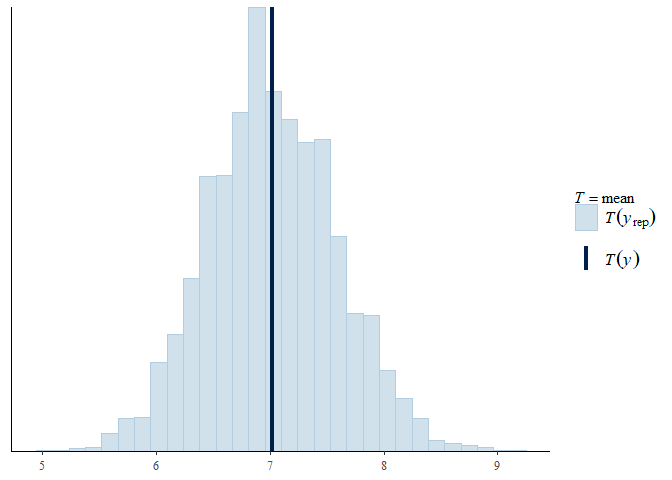
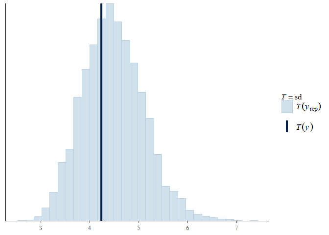
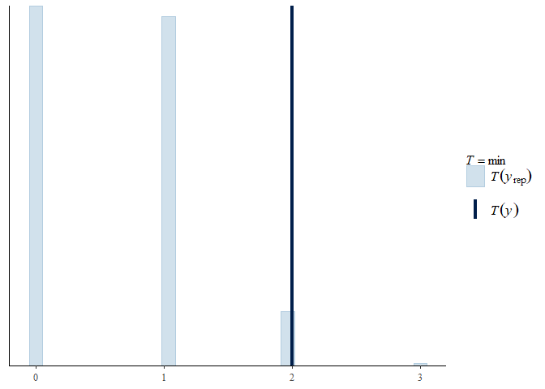
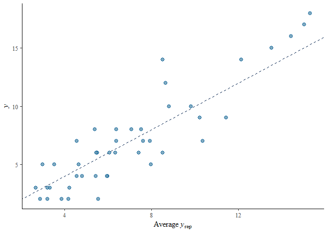
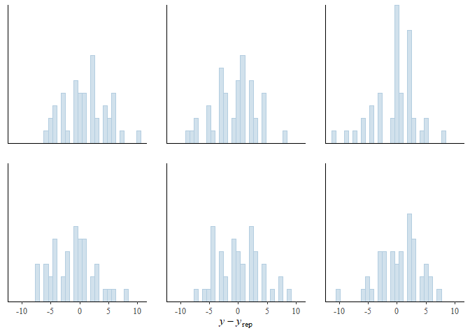
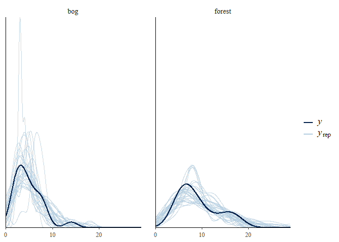

Ant data: Bayesian model checking
================
Brett Melbourne
7 Dec 2021

Sixth in a series of scripts to analyze the ant data described in
Ellison (2004). This script performs some basic model checking for the
best fitting Bayesian model, highlighting the use of posterior
predictive checks.

Set up for Bayesian analysis

``` r
library(ggplot2)
library(rstanarm)
options(mc.cores = parallel::detectCores())
theme_set(theme_grey()) #rstanarm overrides default ggplot theme: set it back
```

Read in the data

``` r
ant <- read.csv("data/ants.csv")
ant$habitat <- factor(ant$habitat)
ant$site <- factor(ant$site) #grouping variable
ant$plot <- factor(1:nrow(ant)) #unit-level identifier for overdispersion
ant$elevation_s <- scale(ant$elevation)
ant$latitude_s <- scale(ant$latitude)
```

Fit the model (this was our best candidate model)

``` r
bayesHLE <- stan_glmer(richness ~ habitat + latitude_s + elevation_s + 
                        (1|site) + (1|plot), 
                        family=poisson, data=ant)
```

The shinystan app has a bunch of diagnostics.

``` r
launch_shinystan(bayesHLE)
```

Click diagnose. I suggest routinely checking these:

-   NUTS (plots), “By model parameter”, top two plots. The left one is
    the trace plot of the chains to assess convergence. The right plot
    is the posterior (check it’s shape). Look at each parameter by
    changing from the pulldown. I usually look at all the fixed effect
    parameters and the variances for the different scales.

-   R\_hat, n\_eff, se\_mean. This is a quick graphical overview but I
    will usually check these by printing a summary table instead.

-   Autocorrelation. This is useful to see how efficient your chains
    are. If the autocorrelation declines quickly with lag, that’s good.

-   PPcheck. Look at all of these. As mentioned in the previous script,
    the idea of the posterior predictive check is to simulate data from
    the fitted model. Does the simulated data look like the real data?
    Check especially “Distribution of observed data vs replications”
    (both histograms and overlaid densities) and “Distributions of test
    statistics”.

You can replicate those diagnostic plots in code using `pp_check()`. I
prefer to use the code versions to keep a record of what I’ve checked
and to add any commentary.

``` r
# Distribution of observed data vs replications, overlaid densities
pp_check(bayesHLE, plotfun = "dens_overlay")
```

<!-- -->

``` r
# Distribution of observed data vs replications, histograms
pp_check(bayesHLE, plotfun = "hist")
```

<!-- -->

``` r
# Distribution of observed data vs replications, boxplots
pp_check(bayesHLE, plotfun = "boxplot", nreps=30)
```

<!-- -->

``` r
# Distributions of test statistic, mean
pp_check(bayesHLE, plotfun = "stat", stat = "mean")
```

<!-- -->

``` r
# Distributions of test statistic, sd
pp_check(bayesHLE, plotfun = "stat", stat = "sd")
```

<!-- -->

``` r
# Distributions of test statistic, mean
pp_check(bayesHLE, plotfun = "stat", stat = "max")
```

<!-- -->

``` r
# Distributions of test statistic, min
pp_check(bayesHLE, plotfun = "stat", stat = "min")
```

<!-- -->

``` r
# Scatterplot of y vs. average yrep
pp_check(bayesHLE, plotfun = "scatter_avg")
```

<!-- -->

``` r
# Residuals
pp_check(bayesHLE, plotfun = "error_hist", nreps = 6)
```

<!-- -->

The above plots show that the fitted model produces data much like the
real data. The one exception is that the real data don’t contain
richness values less than 2, as revealed in the plot of `min` as the
test statistic. Although uncommon, we do sometimes see simulated
datasets with minimum richness of 2, so we are probably not concerned.
The real data may well be such a realization.

There are many other options for `pp_check` graphics to be explored.
Some of the most useful, are the grouped versions. For example:

``` r
pp_check(bayesHLE, plotfun = "ppc_dens_overlay_grouped", group="habitat", nreps=30)
```

which currently has a bug, as the output says. Nevertheless this plot
can be made from the bayesplot package directly.

``` r
bayesplot::ppc_dens_overlay_grouped(y=ant$richness, 
                                    yrep=posterior_predict(bayesHLE, draws=30), 
                                    group=ant$habitat)
```

<!-- -->

Of note, for binomial data, plots show the proportion of successes
rather than the raw count, and `ppc_error_binned()` can be used for
binned residual plots.

See the help topics for more options:

``` r
?pp_check
bayesplot::available_ppc()
```
